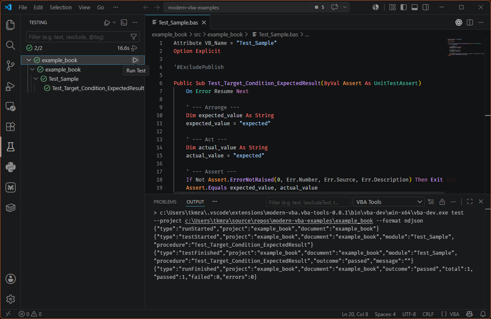

# VBA Tools

Edit exported VBA source files in Visual Studio Code with language-server
features, formatting, Test Explorer integration, and explicit workbook build
commands for Excel VBA projects.

VBA Tools is designed for source-controlled `.bas`, `.cls`, and `.frm` files.
For workbook-backed projects, the extension uses a bundled `vba-dev` command to
build, test, publish, export, and validate Excel macro workbooks from a
`vba-project.json` manifest.

---

## Key Features

- Edit VBA in VS Code with syntax highlighting for `.bas`, `.cls`, and `.frm`
  files.
- Get diagnostics while editing, including parser errors and supported
  validation rules.
- Navigate with completion, hover, signature help, document symbols, workspace
  symbols, go to definition, find references, and rename.
- Use semantic highlighting for declarations and resolved references.
- Format VBA source with the built-in document formatter.
- Run workbook-backed VBA tests from VS Code Test Explorer.
- Run project commands from the Command Palette: Doctor, Build, Test, Publish,
  Export, CommonModules, and VBA project reference operations.
- Open an integrated terminal with `vba-dev` on `PATH` for direct CLI workflows
  such as project creation.
- Keep `vba-project.json` as the manifest for templates, source folders, generated
  workbooks, publish output, CommonModules, references, and command defaults.

---

## Getting Started

### 1 - Install the extension

Launch VS Code Quick Open (`Ctrl+P`), paste this command, and press `Enter`:

```text
ext install modern-vba.vba-tools
```

If you previously installed `tkmr-akhs.vba-tools`, uninstall it before using
`modern-vba.vba-tools`. VS Code treats the new publisher ID as a separate
extension, so both extensions can otherwise remain installed side by side.

### 2 - Prepare Excel

Workbook-backed commands require desktop Excel and trusted access to the VBA
project object model:

1. Open Microsoft Excel.
2. Go to **File** > **Options**.
3. Select **Trust Center**.
4. Click **Trust Center Settings...**.
5. Select **Macro Settings**.
6. Check **Trust access to the VBA project object model**.

### 3 - Create a workbook-backed project

To create a new project with the standard CommonModules and unit-test
foundation:

1. Download `common_modules_repo.zip` from the
   [xls-common-modules releases](https://github.com/modern-vba/xls-common-modules/releases/).
2. Extract it next to the project folder you plan to create:

   ```text
   workspace/
     common_modules_repo/
     example_name/
   ```

3. Press `Ctrl+Shift+P` and run `VBA Tools: Open vba-dev Terminal`.
4. Run `vba-dev new excel -n example_book`.

   The project name should usually match the `.xlsm` basename. When
   `common_modules_repo` is present next to the generated project folder,
   `vba-dev new excel` copies the initial CommonModules into the project.

5. Add any extra external references needed by the workbook:

   ```text
   vba-dev reference add "Microsoft PowerPoint 16.0 Object Library"
   ```

6. Run `vba-dev doctor` to check the generated project setup.

### 4 - Migrate an existing workbook

To start from an existing `.xlsm`, first create the workbook-backed project
folder, replace the generated source template workbook with the existing
workbook, then export that workbook's VBA modules into the generated document
source set:

```text
vba-dev new excel -n example_book
Copy-Item C:\path\to\existing.xlsm .\example_book\src\example_book\example_book.xlsm -Force
vba-dev export --from .\example_book\src\example_book\example_book.xlsm --to .\example_book\src\example_book
```

The copied workbook becomes the source template used by `vba-dev build` and
`vba-dev publish`, so it should contain the sheets, workbook settings, and other
non-VBA workbook content you want to preserve. The `--to` path should be the
document source folder defined by `vba-project.json`. Close the source workbook
before copying or exporting. After export, review the generated source files,
add any required external references with `vba-dev reference add`, and run
`vba-dev doctor`.

### 5 - Open a project or VBA source folder

For language features only, open a folder containing `.bas`, `.cls`, or `.frm`
files and then open a VBA file.

For build, test, publish, export, CommonModules, reference commands, and Test
Explorer integration, open a workspace containing a `vba-project.json` manifest. The
manifest defines the source folder, template workbook, generated workbook,
publish workbook, references, and CommonModules entries for each document.

### 6 - Run Doctor

Run `VBA Tools: Doctor` from the Command Palette, or run `vba-dev doctor` from
the `vba-dev` terminal. Doctor checks project paths, manifest state,
CommonModules state, reference declarations, and machine prerequisites. Results
are written to the VBA Tools output channel and surfaced as VS Code diagnostics
where applicable.

Doctor also performs an active debug-readiness probe in a temporary dedicated
Excel/VBE session. It verifies native breakpoint control, runs a harmless
temporary procedure through the native VBE command, and verifies debug-process
ownership. It then removes all temporary state without changing project files.
Excel or the VBE may appear briefly while this probe runs.

---

## Write Unit Tests

Unit tests live in the same document source set as the production VBA source.
Create standard modules named `Test_*.bas`; `UnitTestMain` discovers public
procedures whose names start with `Test_` and whose first argument is
`UnitTestAssert`.

Use this procedure shape:

```vb
Attribute VB_Name = "Test_Sample"
Option Explicit

'#ExcludePublish

Public Sub Test_Target_Condition_ExpectedResult(ByVal Assert As UnitTestAssert)
    On Error Resume Next

    ' --- Arrange ---
    Dim expected_value As String
    expected_value = "expected"

    ' --- Act ---
    Dim actual_value As String
    actual_value = "expected"

    ' --- Assert ---
    If Not Assert.ErrorNotRaised(0, Err.Number, Err.Source, Err.Description) Then Exit Sub
    Assert.Equals expected_value, actual_value
End Sub
```

Keep each test procedure focused on one condition and one expected result.
Prefer `Arrange`, `Act`, and `Assert` blocks so failures are easy to read in the
unit-test output. Use `Assert.ErrorRaised` for expected errors and
`Assert.ErrorNotRaised` before continuing with value assertions when no error is
expected.

Mark project-local test modules with `'#ExcludePublish` near the top of the
file when they should not be included in published workbooks. Test-only
CommonModules are excluded from publish output automatically through the
CommonModules manifest.

The Test Explorer view shows workbook-backed projects and documents after the
extension discovers `vba-project.json`. Select a project or document and click the
run button to execute tests. Procedure-level test nodes appear after a test run
reports them.


Run tests from the Command Palette with `VBA Tools: Test`, from Test Explorer,
or from the `vba-dev` terminal:

```text
vba-dev test
vba-dev test --module Test_Sample
vba-dev test --module Test_Sample --procedure Test_Target_Condition_ExpectedResult
```

`vba-dev test` builds the selected document before running tests by default. Use
`--no-build` only when you intentionally want to rerun tests against the
existing bin workbook.

---

## Command Palette Commands

| Command | Description |
| --- | --- |
| `VBA Tools: Doctor` | Check workbook project and machine prerequisites. |
| `VBA Tools: Open vba-dev Terminal` | Open a VS Code terminal with the resolved `vba-dev` command on `PATH`. |
| `VBA Tools: Build` | Generate the selected workbook document from template and source. |
| `VBA Tools: Test` | Build, then run VBA unit tests for the selected workbook document. |
| `VBA Tools: Publish` | Generate the publish workbook for the selected document. |
| `VBA Tools: Export` | Export VBA modules from the selected workbook into source. |
| `VBA Tools: Add Common Module` | Add CommonModules entries to the selected document. |
| `VBA Tools: List Common Modules` | List CommonModules entries for the selected document. |
| `VBA Tools: Update Common Modules` | Update installed CommonModules entries. |
| `VBA Tools: List References` | List manifest-defined VBA project references. |
| `VBA Tools: Add Reference` | Add a manifest-defined VBA project reference. |
| `VBA Tools: Remove Reference` | Remove a manifest-defined VBA project reference. |

---

## vba-dev Terminal

Run `VBA Tools: Open vba-dev Terminal` from the Command Palette to open an
integrated terminal whose `PATH` starts with the bundled or configured
`vba-dev` directory. The PATH change is scoped to that terminal only; it does
not install `vba-dev` globally.

Use this terminal for direct CLI workflows, including creating a project:

```text
vba-dev new excel -o <project-dir> -n <project-name>
```

---

## Workbook Project Workflow

### Build

`VBA Tools: Build` creates the configured bin workbook from the template
workbook, applies manifest-defined references, imports exported source files,
and writes the generated workbook output.

From the `vba-dev` terminal, run:

```text
vba-dev build
```

Use build when you want a generated workbook for manual inspection or when a
project has no unit tests. Close the target workbook before building so Excel
can replace the generated output.

### Debug in the VBE (planned)

> This workflow is planned and is not available in the current release.

Pressing F5 in a parameterless public `Sub` in a standard module will save and
rebuild the selected project, open its generated workbook in a dedicated visible
Excel/VBE session, transfer enabled ordinary line breakpoints, and run that
procedure. `Option Private Module` is supported. `launch.json` will be optional
and used only to pin a target.

Interactive debugging, including stepping, watches, the Immediate Window, and
runtime errors, stays in the VBE. VS Code will start, restart, or stop the
session and show progress. Unsupported or invalid breakpoints fail the launch;
VBA Tools will not move them or insert `Stop` statements.

The opened workbook is generated output. Saving it does not update exported VBA
source or the source template, and the next F5 rebuild overwrites it. Make
persistent VBA changes in exported source and persistent workbook-content
changes in the source template.

Open-time events such as `Workbook_Open` will not run automatically. Use an
eligible wrapper `Sub` to debug startup logic. Excel and VBE prompts remain
interactive without a timeout, and trusted access to the VBA project object
model is required.

Stopping or restarting debugging force-closes the dedicated Excel process
without a save prompt. Unsaved changes in every workbook opened in that process
are lost, so do not open unrelated workbooks there. When the Excel process
exits, VS Code reports that the debug session has ended.

### Test

`VBA Tools: Test` runs `vba-dev test` for the selected workbook document. By
default, tests build first so the workbook under test matches the source tree.

### Publish

`VBA Tools: Publish` creates the publish workbook and excludes test-only
CommonModules and source files marked for publish exclusion.

From the `vba-dev` terminal, run:

```text
vba-dev publish
```

Publish is the command for producing the distributable workbook. It uses the
same source import and reference normalization path as build, but writes to the
document's publish output and omits test-only CommonModules plus project-local
files marked with `'#ExcludePublish`.

### Export

`VBA Tools: Export` pulls modules from the selected workbook into the configured
source folder. It is an explicit command, not a live save-time sync.

### CommonModules and References

CommonModules commands edit and update manifest-listed common module entries.
Reference commands edit desired VBA project references in `vba-project.json`; build
and publish apply those references to generated workbooks.

---

## Test Explorer

Workbook-backed projects appear in VS Code Test Explorer when the workspace
contains a readable `vba-project.json` manifest.

| Profile | Behavior |
| --- | --- |
| `Run Tests` | Invokes `vba-dev test --format ndjson` and keeps build-before-test behavior. |
| `Run Tests Without Build` | Invokes `vba-dev test --no-build --format ndjson` for explicit fast reruns against existing generated output. |

Missing or unusable generated output is reported as a test run error in the
no-build profile.

---

## Code Formatter

Set VBA Tools as the default formatter for VBA files and enable format on save:

```json
{
  "[vba]": {
    "editor.defaultFormatter": "modern-vba.vba-tools",
    "editor.formatOnSave": true
  }
}
```

The formatter normalizes VBA keyword and intrinsic word casing, normalizes
resolved source reference casing to the matching definition, and rewrites
leading whitespace according to VBA block depth. It does not rename
declarations, edit sibling files, or rewrite comments and strings.

---

## Block Skeleton Insertion

Block skeleton insertion is enabled by default. When Enter follows the physical
line end of a complete eligible header, VBA Tools first lets VS Code insert its
native line break. The language server then replaces that blank line only when
the exact document version and local syntax prove a safe insertion. A successful
plan adds one indented body line and the matching terminator, places the cursor
on the body line, preserves the document line ending, uses the editor
`indentSize` (with `tabSize` as the protocol fallback), and remains one Undo
operation.

Supported declaration forms are `Sub`, `Function`, `Property Get`,
`Property Let`, `Property Set`, `Enum`, and `Type`, subject to normal VBA module
legality. Supported control forms inside a callable body are block `If`,
`For`, `For Each`, `Select Case`, and `With`.

While locating a safe boundary, blank lines and comment-only apostrophe, `Rem`,
or Doxygen-style `'*` lines are transparent and remain verbatim after the
inserted terminator. A line containing VBA code followed by an inline comment
is still evaluated from its code; the comment suffix does not turn body code,
a declaration, a branch, or a terminator into boundary trivia.

Inside conditional compilation, a skeleton is inserted only when the header,
body, matching terminator, ancestors, safe boundary, and relevant diagnostics
are proven within one well-formed `#If` / `#ElseIf` / `#Else` branch. The
terminator is inserted before a proven branch boundary. Conditional-compilation
directives themselves always keep native Enter. Malformed, nested-ambiguous, or
cross-branch ownership also keeps native Enter without moving or repairing
source.

`Event`, external `Declare`, single-line `If`, `Do...Loop`, `While...Wend`, and
runtime branch headers (`Else`, `ElseIf`, `Case`, and `Case Else`) are excluded.
Existing candidate-owned body content, branches, or terminators are not
rewritten. Disabling the setting, an unavailable or cancelled language server
request, a timeout, stale document state, or any unproven syntax leaves the one
native Enter unchanged.

---

## Settings

| Setting | Default | Description |
| --- | --- | --- |
| `vbaLanguageServer.trace.server` | `off` | Controls LSP trace output for the VBA language server. |
| `vbaTools.devtool.path` | empty | Overrides the bundled `vba-dev` executable path for development or diagnostics. |
| `vbaLanguageServer.blockSkeletonInsertion.enabled` | `true` | Inserts a proven body line and matching terminator after an eligible complete VBA block header; otherwise preserves native Enter. |

---

## Troubleshooting

| Problem | Check |
| --- | --- |
| Language features do not start | The first release supports Windows only. Open the VBA Tools output channel and check whether the bundled language server launched. |
| Workbook commands fail before opening Excel | Run `VBA Tools: Doctor` and confirm that the workspace contains `vba-project.json`. |
| Excel blocks workbook automation | Enable trusted access to the VBA project object model in Excel Trust Center settings. |
| Tests do not appear in Test Explorer | Confirm that `vba-project.json` is in the opened workspace and reload the VS Code window after changing project layout. |
| Format on save does not run | Set `editor.defaultFormatter` for `[vba]` to `modern-vba.vba-tools`. |
| You need to test a custom CLI build | Set `vbaTools.devtool.path` to the full path of the replacement `vba-dev.exe`. |

---

## System Requirements

- Windows 10 or Windows 11.
- VS Code 1.125.0 or later.
- Desktop Microsoft Excel for workbook-backed commands.
- Trusted access to the VBA project object model for workbook automation.
- No separate .NET runtime is required for the bundled Windows executables.

Standalone editing features are available for exported VBA source files. Excel
is only required when running workbook-backed automation commands.

---

## Bundled Tools

Detailed tool documentation is kept with each tool rather than in this
Marketplace README:

- [`vba-dev`](https://github.com/modern-vba/vba-tools/blob/main/tools/vba-dev/README.md)
  - workbook-backed project CLI.
- [`vba-language-server`](https://github.com/modern-vba/vba-tools/blob/main/tools/vba-language-server/README.md)
  - C# LSP server used by the extension.

---

## Version History

See [GitHub Releases](https://github.com/modern-vba/vba-tools/releases) for
published extension changes.
