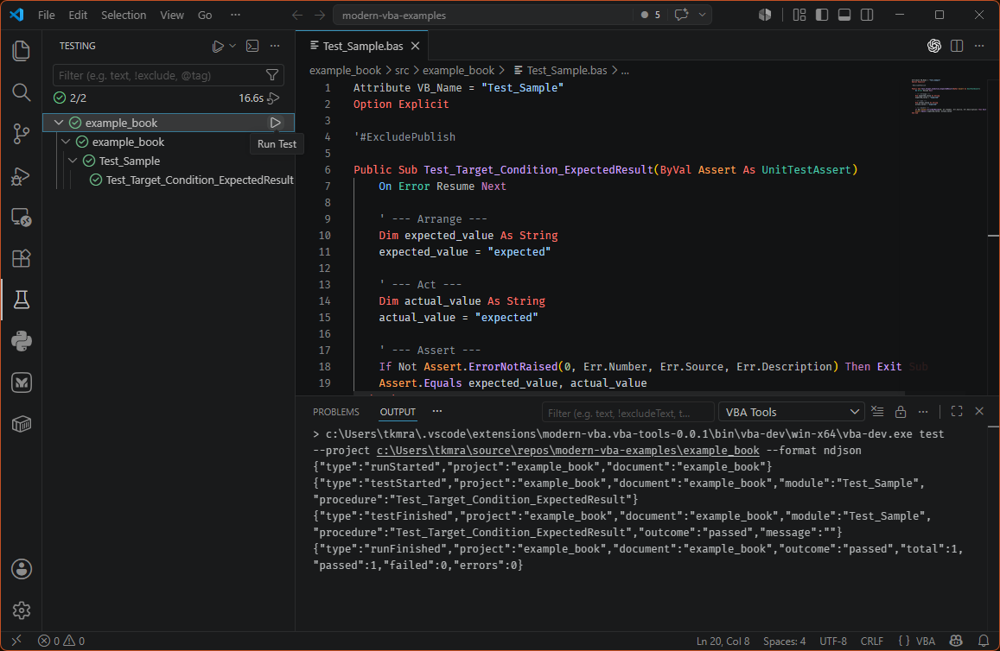

# VBA Tools

Edit exported VBA source files in Visual Studio Code with language-server
features, formatting, Test Explorer integration, and explicit workbook build
commands for Excel VBA projects.

VBA Tools is designed for source-controlled `.bas`, `.cls`, and `.frm` files.
For workbook-backed projects, the extension uses a bundled `vba-dev` command to
build, test, publish, export, and validate Excel macro workbooks from a
`vba-project.json` manifest.

---

## Key Features

- Edit VBA in VS Code with syntax highlighting for `.bas`, `.cls`, and `.frm`
  files.
- Get diagnostics while editing, including parser errors and supported
  validation rules.
- Navigate with completion, hover, signature help, document symbols, workspace
  symbols, go to definition, find references, and rename.
- Use semantic highlighting for declarations and resolved references.
- Format VBA source with the built-in document formatter.
- Run workbook-backed VBA tests from VS Code Test Explorer.
- Keep intrinsic form and document Host Events available to language features
  through document-scoped, last-known-good projection snapshots.
- Debug eligible VBA procedures in the native VBE from VS Code, with ordinary
  source breakpoints.
- Run project commands from the Command Palette: Doctor, Build, Test, Publish,
  Export, CommonModules, and VBA project reference operations.
- Open an integrated terminal with `vba-dev` on `PATH` for direct CLI workflows
  such as project creation.
- Keep `vba-project.json` as the manifest for templates, source folders, generated
  workbooks, publish output, CommonModules, references, and command defaults.

---

## Getting Started

### 1 - Install the extension

Launch VS Code Quick Open (`Ctrl+P`), paste this command, and press `Enter`:

```text
ext install modern-vba.vba-tools
```

If you previously installed `tkmr-akhs.vba-tools`, uninstall it before using
`modern-vba.vba-tools`. VS Code treats the new publisher ID as a separate
extension, so both extensions can otherwise remain installed side by side.

### 2 - Prepare Excel

Workbook-backed commands require x64 Windows 10 or Windows 11, desktop Excel,
and trusted access to the VBA project object model:

1. Open Microsoft Excel.
2. Go to **File** > **Options**.
3. Select **Trust Center**.
4. Click **Trust Center Settings...**.
5. Select **Macro Settings**.
6. Check **Trust access to the VBA project object model**.

VBA Tools does not change this setting, the registry, or Trust Center for you.
If Doctor reports that its dedicated Excel process could not be owned or cleaned
up, close Excel windows you no longer need and retry. If the problem persists,
open the VBA Tools output channel and review the reported check details.

### 3 - Create a workbook-backed project

To create a new project with the standard CommonModules and unit-test
foundation:

1. Download `common_modules_repo.zip` from the
   [xls-common-modules releases](https://github.com/modern-vba/xls-common-modules/releases/).
2. Extract it next to the project folder you plan to create:

   ```text
   workspace/
     common_modules_repo/
     example_name/
   ```

3. Press `Ctrl+Shift+P` and run `VBA Tools: Create Excel VBA Project`.
4. After the command verifies Excel readiness, enter the project name and then
   select its parent folder. The project folder and `.xlsm` basename use the
   project name exactly as entered.

   When `common_modules_repo` is present next to the generated project folder,
   the guided command copies the initial CommonModules into the project. After
   creation commits, choose the offered action if you want to open the manifest
   or project folder; VBA Tools does not change the workspace automatically.

5. Add any extra external references needed by the workbook:

   ```text
   vba-dev reference add "Microsoft PowerPoint 16.0 Object Library"
   ```

6. Run `vba-dev doctor` to check the generated project setup.

### 4 - Migrate an existing workbook

To start from an existing `.xlsm`, first create the workbook-backed project
folder, replace the generated source template workbook with the existing
workbook, then export that workbook's VBA modules into the generated document
source set:

```text
vba-dev new excel -n example_book
Copy-Item C:\path\to\existing.xlsm .\example_book\src\example_book\example_book.xlsm -Force
vba-dev export --from .\example_book\src\example_book\example_book.xlsm --to .\example_book\src\example_book
```

The copied workbook becomes the source template used by `vba-dev build` and
`vba-dev publish`, so it should contain the sheets, workbook settings, and other
non-VBA workbook content you want to preserve. The `--to` path should be the
document source folder defined by `vba-project.json`. Close the source workbook
before copying or exporting. After export, review the generated source files,
add any required external references with `vba-dev reference add`, and run
`vba-dev doctor`.

### 5 - Open a project or VBA source folder

For language features only, open a folder containing `.bas`, `.cls`, or `.frm`
files and then open a VBA file.

For build, test, publish, export, CommonModules, reference commands, and Test
Explorer integration, open a workspace containing a `vba-project.json` manifest. The
manifest defines the source folder, template workbook, generated workbook,
publish workbook, references, and CommonModules entries for each document.

### 6 - Run Doctor

Run `VBA Tools: Doctor` from the Command Palette. It first runs
`vba-dev doctor --format json` in its default project scope for **Project
automation**, then independently runs
`vba-debug-adapter doctor --format json` for **VBE debugging**, even when the
project diagnostic reports a failure. The project diagnostic checks project
paths, manifest state, CommonModules state, reference declarations, and
workbook-automation prerequisites. The VBE diagnostic uses temporary adapter-
owned fixture state to check visible Excel/VBE startup, native breakpoint and
break-mode commands, process ownership, and cleanup without changing persistent
project files.

Complete output from both diagnostics, including every VBE check and any
remediation details, is written under the two labels in the VBA Tools output
channel. VBA Tools shows at most one blocking notification and keeps the full
details in that channel. Cancelling during project Doctor sends the versioned
cooperative request and waits for the ordinary `vba-dev` child to close. Exit
`130` ends the aggregate silently before adapter Doctor starts, while exit `0`
or failure and its terminal result remain authoritative after the local request.
The two executables remain independent: `vba-dev doctor` defaults to project
scope and never invokes the adapter. Once the VBE stage starts, cancellation
sends its separate versioned cooperative request and waits for the adapter to
finish terminal Excel and workspace cleanup before the result is classified. A
failed cancellation delivery or invalid terminal JSON remains an infrastructure
failure in the Output Channel.

For an Excel-free CI check, run `vba-dev check`. To inspect only ordinary Excel
automation readiness without discovering a project, run
`vba-dev doctor --scope environment --format json`. Direct CLI cancellation
returns exit `130` only after owned-resource cleanup is proven; an observed
failure remains a failure.

| Readiness property | `vba-dev check` | project Doctor (default) | environment Doctor | adapter Doctor |
| --- | --- | --- | --- | --- |
| Manifest, paths, source identity, CommonModules, command defaults | Proves static facts | Includes the static facts | No project access | No project access |
| Selected-reference availability and resolution | No live proof | Resolves every selected reference | No | No |
| Applying references to a generated workbook | No | No | No | No |
| Disposable project-template open and `VBProject` access | No | Checks materialization readiness | No project template | No project template |
| Ordinary Windows, COM, owned Excel, VBIDE, and cleanup readiness | No | Includes the five environment checks | Owns exactly the five checks | No; debug-fixture evidence is separate |
| VBA compilation, source import, or workbook save | No | No | No | No |
| Native VBE command context, breakpoint, break mode, and Continue | No | No | No | Proves debug readiness |
| Requires a project | Yes | Yes | No | No |
| Starts Excel | Never | May start dedicated owned instances | Starts one dedicated owned instance | Starts a dedicated adapter-owned fixture |
| CI-safe without Excel | Yes | No | No | No |

---

## Write Unit Tests

Unit tests live in the same document source set as the production VBA source.
Create standard modules named `Test_*.bas`; `UnitTestMain` discovers public
procedures whose names start with `Test_` and whose first argument is
`UnitTestAssert`.

Use this procedure shape:

```vb
Attribute VB_Name = "Test_Sample"
Option Explicit

'#ExcludePublish

Public Sub Test_Target_Condition_ExpectedResult(ByVal Assert As UnitTestAssert)
    On Error Resume Next

    ' --- Arrange ---
    Dim expected_value As String
    expected_value = "expected"

    ' --- Act ---
    Dim actual_value As String
    actual_value = "expected"

    ' --- Assert ---
    If Not Assert.ErrorNotRaised(0, Err.Number, Err.Source, Err.Description) Then Exit Sub
    Assert.Equals expected_value, actual_value
End Sub
```

Keep each test procedure focused on one condition and one expected result.
Prefer `Arrange`, `Act`, and `Assert` blocks so failures are easy to read in the
unit-test output. Use `Assert.ErrorRaised` for expected errors and
`Assert.ErrorNotRaised` before continuing with value assertions when no error is
expected.

Mark project-local test modules with `'#ExcludePublish` near the top of the
file when they should not be included in published workbooks. Test-only
CommonModules are excluded from publish output through each installed entry's
recorded `testOnly` value in `vba-project.json`.

The Test Explorer view shows workbook-backed projects and documents after the
extension discovers `vba-project.json`. Select a project or document and click the
run button to execute tests. Procedure-level test nodes appear after a test run
reports them.


Run tests from the Command Palette with `VBA Tools: Test`, from Test Explorer,
or from the `vba-dev` terminal:

```text
vba-dev test
vba-dev test --module Test_Sample
vba-dev test --module Test_Sample --procedure Test_Target_Condition_ExpectedResult
```

`vba-dev test` builds the selected document before running tests by default. Use
`--no-build` only when you intentionally want to rerun tests against the
existing bin workbook.

---

## Command Palette Commands

| Command | Description |
| --- | --- |
| `VBA Tools: Doctor` | Check project automation, then independently check VBE debugging prerequisites. |
| `VBA Tools: Open vba-dev Terminal` | Open a VS Code terminal with the resolved `vba-dev` command on `PATH`. |
| `VBA Tools: Build` | Generate the selected workbook document from template and source. |
| `VBA Tools: Test` | Build, then run VBA unit tests for the selected workbook document. |
| `VBA Tools: Publish` | Generate the publish workbook for the selected document. |
| `VBA Tools: Export` | Export VBA modules from the selected workbook into source. |
| `VBA Tools: Refresh Host Events` | Reinspect intrinsic Host Events for one selected workbook document. |
| `VBA Tools: Add Common Module` | Add CommonModules entries to the selected document. |
| `VBA Tools: List Common Modules` | List CommonModules entries for the selected document. |
| `VBA Tools: Update Common Modules` | Update installed CommonModules entries. |
| `VBA Tools: List References` | List manifest-defined VBA project references. |
| `VBA Tools: Add Reference` | Add a manifest-defined VBA project reference. |
| `VBA Tools: Remove Reference` | Remove a manifest-defined VBA project reference. |

---

## vba-dev Terminal

Run `VBA Tools: Open vba-dev Terminal` from the Command Palette to open an
integrated terminal whose `PATH` starts with the bundled or configured
`vba-dev` directory. The PATH change is scoped to that terminal only; it does
not install `vba-dev` globally.

Use this terminal for direct CLI workflows, including creating a project:

```text
vba-dev new excel -o <project-dir> -n <project-name>
```

---

## Workbook Project Workflow

### Build

`VBA Tools: Build` creates the configured bin workbook from the template
workbook, applies manifest-defined references, imports exported source files,
and writes the generated workbook output.

Workbook open and save stages each use a 300-second timeout by default. A
project can set positive whole-second overrides through
`commandDefaults.excelAutomation.workbookOpenTimeoutSeconds` and
`commandDefaults.excelAutomation.workbookSaveTimeoutSeconds` in
`vba-project.json`; these values have no per-invocation CLI options.

Build and publish run in a dedicated hidden Excel process and stage their
selected output beside its destination. Excel startup uses a 30-second
deadline, each reference attempt 60 seconds, each module import 30 seconds,
and cooperative cleanup 5 seconds. The prior completed output remains in place
until reference normalization, import, verification, save, and owned-process
cleanup have completed; only then is the selected target replaced atomically.

From the `vba-dev` terminal, run:

```text
vba-dev build
```

Use build when you want a generated workbook for manual inspection or when a
project has no unit tests. Close the target workbook before building so Excel
can replace the generated output.

### Debug in the VBE

With the cursor in a parameterless public `Sub` in a standard module, press F5
and select `VBA: Active Procedure`. VBA Tools captures an immutable snapshot of
the selected project's clean files and dirty editor content without saving,
builds a same-filename workbook in an adapter-owned temporary directory, opens
it in a dedicated visible Excel/VBE session, transfers breakpoints, and runs the
procedure. `Option Private Module` is supported. Desktop Excel and trusted
access to the VBA project object model are required.

To pin a target independently of the active editor, save a configuration in
`.vscode/launch.json`:

```json
{
  "version": "0.2.0",
  "configurations": [
    {
      "type": "vba",
      "request": "launch",
      "name": "Debug VBA target",
      "project": "${workspaceFolder}/example_name",
      "document": "example_book",
      "module": "DebugModule",
      "procedure": "RunTarget"
    }
  ]
}
```

`project` and `document` narrow the selected workbook-backed project. `module`
and `procedure` must be supplied together; omit both to use the active eligible
procedure.

The target must be a public, parameterless `Sub` in a standard module. Private
procedures, procedures with parameters, `Function` and `Property` procedures,
and procedures in class, form, or document modules cannot be launched directly;
use an eligible wrapper `Sub` when needed.

Interactive debugging stays in the VBE. Use the VBE for stepping, watches,
runtime errors, the Immediate Window, and `Debug.Print` output. VS Code reports
the session as running even while the VBE is in break mode. Existing VBE error
handling settings, watches, and `Stop` statements can also pause execution.

VBA Tools transfers enabled ordinary line breakpoints from the selected `.bas`,
`.cls`, and `.frm` source set. Conditional breakpoints, hit-count breakpoints,
logpoints, and breakpoints on non-executable or inactive conditional-compilation
lines are not supported for the selected snapshot target and stop the launch
instead of being moved. Unsupported breakpoints outside the selected target do
not block it. Breakpoint changes made after launch take effect in a new session.
A debug session can also run without breakpoints.

Restart Debugging captures a new immutable snapshot from the project and
document bound at launch, including unsaved editor bytes without saving them.
Changing the active editor or supplying different restart arguments does not
retarget the session. The adapter validates the complete fresh snapshot and
restart identity before terminating the old owned Excel process; capture or
identity failures fail only Restart and leave the current session active.

The opened workbook is disposable session state, not the configured source
template, bin workbook, or publish workbook. Saving it changes only the
adapter-owned temporary copy. The source files, source template, bin output, and
publish output remain unchanged, and all debug-workbook changes are discarded
when the session ends. Make persistent changes in the exported source or source
template instead.

Open-time events such as `Workbook_Open` do not run automatically. Use an
eligible wrapper `Sub` to debug startup logic. Excel and VBE prompts remain
interactive without a timeout.

Only one VBA debug session can run in a VS Code window, and attaching to an
existing Excel process is not supported. Normal procedure completion leaves the
session active for further VBE interaction. Close the debug Excel process to end
the session.

Stopping the debug session closes its dedicated Excel process without saving
the temporary workbook. Do not open unrelated workbooks in that process because
their unsaved changes would also be discarded.

### Test

`VBA Tools: Test` runs `vba-dev test` for the selected workbook document. By
default, tests build first so the workbook under test matches the source tree.

### Publish

`VBA Tools: Publish` creates the publish workbook and excludes CommonModules
recorded as test-only in `vba-project.json` plus source files marked for publish
exclusion.

From the `vba-dev` terminal, run:

```text
vba-dev publish
```

Publish is the command for producing the distributable workbook. It uses the
same source import and reference normalization path as build, but writes to the
document's publish output and omits CommonModules recorded with `testOnly: true`
plus project-local files marked with `'#ExcludePublish`. Build and publish do not
consult the current CommonModules repository.

### Export

`VBA Tools: Export` pulls modules from the selected workbook into the configured
source folder. It is an explicit command, not a live save-time sync. Before a
cleanup-enabled export, VS Code shows the resolved absolute destination and
warns that existing source may be overwritten and stale `.bas`, `.cls`, `.frm`,
and `.frx` files will be deleted. Canceling that confirmation does not invoke
the export process. Proceeding uses the ordinary VBA Tools Output, progress
cancellation, workbook-lock reporting, and owned Excel lifecycle.

The `vba-dev export` CLI remains non-interactive for automation. Invoking a
project export, or supplying an explicit `--to` destination, is consent to its
documented overwrite and cleanup behavior. The command exports the complete
workbook source to staging, validates the full placement and stale-file deletion
plan, and protects affected destination files in a recovery area on the same
file system before changing the destination. Success adds or replaces current
modules and removes stale VBA sources and form sidecars without changing the
source template or unrelated files.

If apply fails, `vba-dev` restores the previous destination. If that rollback
cannot be completed, it retains the recovery area and reports its absolute path
and manual recovery steps. An explicit `export --from <workbook>` without
`--to` instead writes to the current directory without stale-file cleanup and
does not require confirmation.

### CommonModules and References

CommonModules commands edit and update manifest-listed common module entries.
Reference commands edit desired VBA project references in `vba-project.json`; build
and publish apply those references to generated workbooks.

---

## Host Events

For each active document in `vba-project.json`, VBA Tools inspects the selected
source-template workbook and supplies intrinsic form and document Host Events
to the language server as one immutable, document-wide snapshot. Inspection
runs on document activation, an effective document or template identity
change, a create/change/delete event for that same template, or an explicit
`VBA Tools: Refresh Host Events` command. Automatic triggers use a one-second
trailing-edge debounce and one extension-wide queue permits only one
`host-class list` process at a time. While a manifest edit is being debounced,
the extension fences matching in-flight results until the final effective
document and source-template context has been resolved.

Editing exported `.bas`, `.cls`, `.frm`, or `.frx` source does not start Excel.
Those edits only reevaluate source association through an explicit,
case-insensitive `Attribute VB_Name` and a compatible component kind. Active
editor changes, reference refreshes, and build, test, publish, or output
workbook changes also do not trigger inspection unless the selected template
identity changes. Synchronous completion, hover, diagnostics, and other editor
requests use the latest committed snapshot and never launch or wait for Excel.

The current exported-source collector associates `.frm` form sources only.
An exported `.cls` remains an ordinary `ClassModule` and is never inferred to
be an intrinsic document module from its name, metadata flags, or a matching
projection. A future document-source adapter must provide authoritative
document provenance before document-source association becomes active.

`VBA Tools: Refresh Host Events` lets you choose one manifest document, joins
the same queue without debounce, and shows cancellable progress. A clean
success is silent. Inspection failures and source-association problems remain
in the VBA Tools output channel; an explicit failure offers `Show Output`, and
a successful explicit refresh with association problems shows one warning with
the same action. Background failure and cancellation do not show popups.

The `VBA Host Events` status item appears only while inspection is queued or
running or when attention is required. Its hover identifies the project,
document, lifecycle state, last-known-good use, reason, and association-failure
counts; selecting it opens Output and does not retry. Failed, partial,
cancelled, or unverified inspection preserves applicable last-known-good data
and schedules no timer-based retry. Correct the template or `Attribute
VB_Name`, then use a later lifecycle trigger or the explicit refresh command.
Host Event inspection requires a trusted workspace, desktop Excel, and trusted
access to the VBA project object model.

---

## Semantic Module Rename

Rename on an exported module identity starts from authoritative
`Attribute VB_Name` metadata or another resolved use of that same module. A
missing attribute is only a filename fallback, and malformed, misplaced,
duplicate, invalid, or overlength metadata must be repaired or re-exported
before Rename. VBA module names are limited to 31 Unicode code points.

When the source basename matches the old module name, `.bas`, `.cls`, or `.frm`
follows the semantic Rename; a matching `.frx` follows its form. A deliberately
different basename is preserved, while an intentional case-only Rename applies
the requested final casing. Installed CommonModules and workbook-owned form or
document components are not silently detached or renamed through source F2.

The server checks the complete semantic edit set, current project and
reference-name authority, source and sidecar bytes, destination collisions, and
client support for ordered file operations before returning all required text
and file changes or no plan.

---

## Complete Contract-Backed Declarations

In a class, form, or document module, completion can supply names required by
an intrinsic Host Event, a `WithEvents` variable, or an `Implements`
relationship. It also includes the Property accessors derived from Public
variables on an implemented interface.

Start a `Sub`, `Function`, `Property Get`, `Property Let`, or `Property Set`
declaration and request completion in the name slot. VBA Tools first offers
only semantic prefixes such as `UserForm_`, `publisher_`, or `IFoo_`. Accepting
one in VS Code reopens suggestions and the second stage offers matching
contract member names. If suggestions do not reopen, press `Ctrl+Space`; the
server keeps no selection state and resolves the same second stage from the
current source and project snapshot.

The space trigger opens the prefix stage only in a valid empty declaration-name
slot. The `_` trigger is likewise limited to a proven contract declaration-name
context: an exact viable prefix opens the member stage, while viable longer
prefixes can remain when the exact prefix has no surviving member. Explicit
completion retains the usual VBA candidates elsewhere. Case-insensitively
identical contracts coalesce; the detail and documentation preserve every
applicable Event or interface signature, including conditional alternatives,
without selecting a compilation branch.

Names already occupied in the same VBA scope are suppressed under the ordinary
declaration-collision rules. All-guarded alternatives remain available, and
complementary Property Get, Let, and Set accessors do not block one another.
`[#If]` is a generic provenance marker; it never exposes or selects a condition.

Completion inserts a name only. It does not add parentheses, parameters, a
body, an `End` statement, or a snippet. Generating a complete member belongs to
the separate future `MemberStubGeneration` feature.

---

## Test Explorer

Workbook-backed projects appear in VS Code Test Explorer when the workspace
contains a readable `vba-project.json` manifest.

| Profile | Behavior |
| --- | --- |
| `Run Tests` | Captures a caller-owned source snapshot, including dirty editors without saving them, then invokes `vba-dev test --source-snapshot <temporary-directory> --format ndjson`. |
| `Run Tests Without Build` | Skips saving and snapshot capture, then invokes `vba-dev test --no-build --format ndjson` against existing generated output. |

Missing or unusable generated output is reported as a test run error in the
no-build profile. When selected source is dirty, no-build results remain
available but source navigation is omitted because the workbook was not rebuilt.

---

## Code Formatter

Set VBA Tools as the default formatter for VBA files and enable format on save:

```json
{
  "[vba]": {
    "editor.defaultFormatter": "modern-vba.vba-tools",
    "editor.formatOnSave": true
  }
}
```

The formatter normalizes VBA keyword and intrinsic word casing, normalizes
resolved source reference casing to the matching definition, and rewrites
leading whitespace according to VBA block depth. It does not rename
declarations, edit sibling files, or rewrite comments and strings.

---

## Block Skeleton Insertion

Block skeleton insertion is enabled by default. Press Enter at the end of a
complete supported block header to insert an indented body line and the matching
terminator as one Undo operation.

Supported declaration forms are `Sub`, `Function`, `Property Get`,
`Property Let`, `Property Set`, `Enum`, and `Type`, subject to normal VBA module
legality. Supported control forms inside a callable body are block `If`,
`For`, `For Each`, `Select Case`, and `With`.

`Event`, external `Declare`, single-line `If`, `Do...Loop`, `While...Wend`, and
Existing body content, branches, and terminators are not rewritten. When the
source is incomplete or ambiguous, including an unsafe conditional-compilation
boundary, VBA Tools keeps the normal Enter behavior and does not repair the
source.

---

## Restricted Mode

VBA Tools keeps source viewing and language assistance available in Restricted
Mode, but blocks managed `vba-dev`, Microsoft Excel/VBIDE, Doctor,
`vba-debug-adapter`, Test Explorer, debugging, and vba-dev terminal launches.
A blocked invocation starts no managed process, changes no project, and adds no
command entry to VBA Tools Output.

`VBA Tools: Create Excel VBA Project` remains visible and offers **Manage
Workspace Trust** and **Open Empty Window**. Other blocked commands offer
**Manage Workspace Trust**. These actions only open the corresponding VS Code
UI; they do not grant trust, start tooling, or resume the command. After granting
trust, invoke the command again.

While the window is untrusted, VBA Tools does not read
`vbaTools.devtool.path` or `vbaTools.debugAdapter.path`, so workspace values
cannot influence executable selection.

---

## Settings

| Setting | Default | Description |
| --- | --- | --- |
| `vbaLanguageServer.trace.server` | `off` | Controls LSP trace output for the VBA language server. |
| `vbaTools.devtool.path` | empty | Overrides the bundled `vba-dev` executable with a compatible executable. VBA Tools does not read this setting while the window is untrusted. |
| `vbaTools.debugAdapter.path` | empty | Overrides the bundled `vba-debug-adapter` executable for debugging and VBE Doctor. The adapter must advertise the required Doctor stdin-cancellation feature. A missing or incompatible explicit path fails without falling back to the bundled adapter. VBA Tools does not read this setting while the window is untrusted. |
| `vbaLanguageServer.blockSkeletonInsertion.enabled` | `true` | Inserts a proven body line and matching terminator after an eligible complete VBA block header; otherwise preserves native Enter. |

---

## Troubleshooting

| Problem | Check |
| --- | --- |
| Language features do not start | VBA Tools currently supports Windows only. Open the VBA Tools output channel and check whether the bundled language server launched. |
| Workbook commands fail before opening Excel | Run `VBA Tools: Doctor`, review the `Project automation` section, and confirm that the workspace contains `vba-project.json`. |
| F5 cannot establish VBE debugging | Run `VBA Tools: Doctor` and review the `VBE debugging` checks and remediation in the VBA Tools output channel. |
| VBE Doctor reports an adapter infrastructure failure | Check the executable path and compatibility details in the VBA Tools output channel. If `vbaTools.debugAdapter.path` is set, correct or clear the explicit path; invalid overrides intentionally do not fall back. |
| Excel blocks workbook automation | Enable trusted access to the VBA project object model in Excel Trust Center settings. |
| Host Events remain queued, unavailable, or last-known-good | Select the `VBA Host Events` status item, review generation, context, reason, and cleanup details in VBA Tools Output, confirm the selected source template exists and is closed, then run `VBA Tools: Refresh Host Events`. There is no automatic retry. |
| A form or document source cannot associate with Host Events | Review the complete association record in VBA Tools Output and repair or re-export its explicit `Attribute VB_Name`; file names and display names are not association fallbacks. |
| Module Rename reports `resourceOperationConflict` | Follow its `condition`, `path`, and `guidance`: reload or restore a changed or missing source, repair or re-export a displaced form sidecar, or remove the destination collision, then invoke Rename again. No partial plan was returned. |
| Module Rename changes only part of the workspace or reports an application failure | Run Undo immediately and verify both source text and source-unit files, including `.frx`. Repair the destination, permissions, or filesystem-provider state, then request Rename again. If VS Code retains stale file models, close the affected editors or reload the window before retrying. |
| Tests do not appear in Test Explorer | Confirm that `vba-project.json` is in the opened workspace and reload the VS Code window after changing project layout. |
| Format on save does not run | Set `editor.defaultFormatter` for `[vba]` to `modern-vba.vba-tools`. |
| You need to test a custom CLI build | Set `vbaTools.devtool.path` to the full path of the replacement `vba-dev.exe`. |
| You need to test a custom debug adapter | Set `vbaTools.debugAdapter.path` to the full path of a compatible `vba-debug-adapter.exe`; invalid overrides intentionally do not fall back. |

---

## System Requirements

- Windows 10 or Windows 11 on x64 hardware.
- The initial Marketplace package uses the VS Code `win32-x64` target.
- VS Code 1.125.0 or later.
- Desktop Microsoft Excel for workbook-backed commands.
- Trusted access to the VBA project object model for workbook automation.
- No separate .NET runtime is required for the bundled Windows executables.

Standalone editing features are available for exported VBA source files. Excel
is required for manifest-backed workbook automation, including automatic or
explicit Host Event inspection. Synchronous editor requests never start or
wait for that inspection.

---

## Bundled Tools

Detailed tool documentation is kept with each tool rather than in this
Marketplace README:

- [`vba-dev`](https://github.com/modern-vba/vba-tools/blob/main/tools/vba-dev/README.md)
  - workbook-backed project CLI.
- [`vba-debug-adapter`](https://github.com/modern-vba/vba-tools/blob/main/tools/vba-debug-adapter/README.md)
  - standalone native VBE debug companion managed by the extension.
- [`vba-language-server`](https://github.com/modern-vba/vba-tools/blob/main/tools/vba-language-server/README.md)
  - C# LSP server used by the extension.

---

## Version History

See the packaged [changelog](CHANGELOG.md) for the current extension history and
[GitHub Releases](https://github.com/modern-vba/vba-tools/releases) for
published artifacts. Use the [support policy](SUPPORT.md) for issue and private
security-reporting paths.
