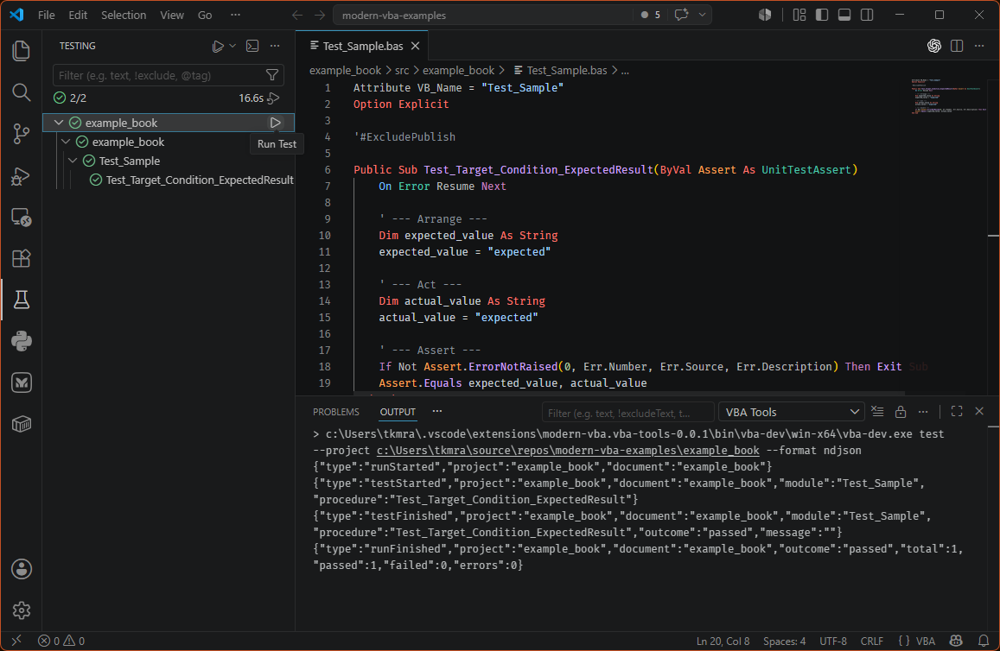

# VBA Tools

Edit exported VBA source files in Visual Studio Code with language-server
features, formatting, Test Explorer integration, and explicit workbook build
commands for Excel VBA projects.

VBA Tools is designed for source-controlled `.bas`, `.cls`, and `.frm` files.
For workbook-backed projects, the extension uses a bundled `vba-dev` command to
build, test, publish, export, and validate Excel macro workbooks from a
`vba-project.json` manifest.

`vba-dev` remains an independently buildable command-line product. The
extension and other tools consume its public process contract; the CLI does not
depend on those consumers. A failure owned by the central grammar router exits
`1`, leaves stdout empty, and writes exactly two physical stderr lines: one
canonical diagnostic and one short command-local help hint, with a final
newline. The router applies deterministic phase ordering to structural parsing
and cardinality checks and to value, relationship, standalone, and closed-intent
rules as their actual command declarations register them. The sealed Build and
Publish family, the sealed Import and Export family, the sealed Test family,
the sealed Reference family, the sealed CommonModules family, the sealed Host
Event family, the sealed Check and Doctor inspection family, the sealed project-
creation family, the sealed Debug preparation family, and the sealed terminal-
contract family now own all public leaves, their closed command intents or
terminal actions, and their
actual symbols on the same graph. A narrow ownership ledger records only family
types and actual command references so the completed graph can prove exact-once
ownership without becoming another command catalog. The completed migration is
described by
[ADR 0038](docs/adr/0038-establish-the-vba-dev-command-grammar.md).
Valid help, standalone version, completion, and capabilities requests remain
side-effect-free terminal successes on stdout; failed Test runs and failed
Doctor checks remain command results rather than grammar failures.

---

## Key Features

- Edit VBA in VS Code with syntax highlighting for `.bas`, `.cls`, and `.frm`
  files.
- Get diagnostics while editing, including parser errors and supported
  validation rules.
- Navigate with completion, hover, signature help, document symbols, workspace
  symbols, go to definition, find references, and rename.
- Use semantic highlighting for declarations and resolved references.
- Format VBA source with the built-in document formatter.
- Run workbook-backed VBA tests from VS Code Test Explorer.
- Keep intrinsic UserForm Events available to language features through one
  environment-scoped current catalog.
- Debug eligible VBA procedures in the native VBE from VS Code, with ordinary
  source breakpoints.
- Run project commands from the Command Palette: Doctor, Build, Test, Publish,
  Export, CommonModules, and VBA project reference operations.
- Open an integrated terminal with `vba-dev` on `PATH` for direct CLI workflows
  such as project creation.
- Keep `vba-project.json` as the manifest for source workbooks, source folders,
  legacy test output, publish output, CommonModules, references, and command defaults.

---

## Editor readiness and project diagnostics

Exported class headers from `VERSION 1.0 CLASS` through `END` use metadata
highlighting, including their `BEGIN` and `END` delimiters. Recognition permits
leading blank lines and comments. At the header boundary, ordinary VBA keyword
highlighting resumes; incomplete headers recover before identifiable body code.

When you open or change a manifest-backed VBA source, semantic highlighting
and the other editor language features become available from one exact,
immutable project snapshot. They do not wait for every project-wide validation
rule, companion capability inspection, CLI-backed reference refresh, or
UserForm Event discovery to finish. The extension starts and initializes the
language client first. Document-local syntax and validation problems can appear
immediately; project-wide problems and companion-backed metadata may update
shortly afterward.

Only a complete result for the latest applicable source, manifest, and
reference-catalog revision is published. A newer edit replaces obsolete
background validation, while unchanged files keep their last accepted Problems
until the newer complete result is ready. This editor path does not launch
Excel or automate a live workbook.

Each successful selected catalog commit cancels affected validation without
starting a full pass for that individual commit. One latest pass is requested
after the shared catalog batch settles. Project retirement removes its refresh
routing, so late background completion cannot restore obsolete work.

If a closed source file is temporarily locked during a save or its bytes cannot
be read, Problems reports `disk-source-unavailable` for that file instead of
stopping the language server. Unreadable source is not replaced with empty or
cached text. Other open documents keep receiving local diagnostics; a later
readable reload, open editor buffer, or deletion clears the read failure.

---

## Getting Started

### 1 - Install the extension

Launch VS Code Quick Open (`Ctrl+P`), paste this command, and press `Enter`:

```text
ext install modern-vba.vba-tools
```

If you previously installed `tkmr-akhs.vba-tools`, uninstall it before using
`modern-vba.vba-tools`. VS Code treats the new publisher ID as a separate
extension, so both extensions can otherwise remain installed side by side.

### 2 - Prepare Excel

Workbook-backed commands require x64 Windows 10 or Windows 11, desktop Excel,
and trusted access to the VBA project object model:

1. Open Microsoft Excel.
2. Go to **File** > **Options**.
3. Select **Trust Center**.
4. Click **Trust Center Settings...**.
5. Select **Macro Settings**.
6. Check **Trust access to the VBA project object model**.

VBA Tools does not change this setting, the registry, or Trust Center for you.
If Doctor reports that its dedicated Excel process could not be owned or cleaned
up, close Excel windows you no longer need and retry. If the problem persists,
open the VBA Tools output channel and review the reported check details.

### 3 - Create a workbook-backed project

To create a new project with the standard CommonModules and unit-test
foundation:

1. Download `common_modules_repo.zip` from the
   [xls-common-modules releases](https://github.com/modern-vba/xls-common-modules/releases/).
2. Extract it next to the project folder you plan to create:

   ```text
   workspace/
     common_modules_repo/
     example_name/
   ```

3. Press `Ctrl+Shift+P` and run `VBA Tools: Create Excel VBA Project`.
4. After the command verifies Excel readiness, enter the project name and then
   select its parent folder. The project folder and `.xlsm` basename use the
   project name exactly as entered.

   When `common_modules_repo` is present next to the generated project folder,
   the guided command copies the initial CommonModules into the project. After
   creation commits, choose the offered action if you want to open the manifest
   or project folder; VBA Tools does not change the workspace automatically.

   New projects use `src/<document>/<document>.xlsm` as the source workbook and
   `publish/<document>.xlsm` as the separate Publish output. Creation does not
   make a workbook-output `bin` directory or emit `binPath` in the manifest or
   creation receipt.

5. Add any extra external references needed by the workbook:

   ```text
   vba-dev reference add "Microsoft PowerPoint 16.0 Object Library"
   ```

6. Run `vba-dev doctor` to check the generated project setup.

### 4 - Migrate an existing workbook

To start from an existing `.xlsm`, first create the workbook-backed project
folder, replace the generated source template workbook with the existing
workbook, then export that workbook's VBA modules into the generated document
source set:

```text
vba-dev new excel -n example_book
Copy-Item C:\path\to\existing.xlsm .\example_book\src\example_book\example_book.xlsm -Force
vba-dev export --from .\example_book\src\example_book\example_book.xlsm --to .\example_book\src\example_book
```

The copied workbook becomes the source workbook updated in place by ordinary
`vba-dev build` and the template copied by `vba-dev publish`, so it should contain
the sheets, workbook settings, and other non-VBA content you want to preserve.
The `--to` path should be the
document source folder defined by `vba-project.json`. Close the source workbook
before copying or exporting. After export, review the generated source files,
add any required external references with `vba-dev reference add`, and run
`vba-dev doctor`.

### 5 - Open a project or VBA source folder

For language features only, open a folder containing `.bas`, `.cls`, or `.frm`
files and then open a VBA file.

For build, test, publish, export, CommonModules, reference commands, and Test
Explorer integration, open a workspace containing a `vba-project.json` manifest. The
manifest defines the source folder, source workbook,
publish workbook, references, and CommonModules entries for each document.

`binPath` is no longer required. Supported older manifests remain usable, but a
configured `binPath` produces an actionable warning: it is deprecated and
scheduled for removal. Remove that property from the manifest to retire the
setting; this does not require deleting its workbook. Commands preserve an
omitted property when editing the manifest and never automatically delete,
rewrite, rename, or move existing bin files or manifest-selected source workbooks.
Ordinary Build, Debug, Test (including no-build), and project Export use the
exact `templatePath`; project Doctor does not require a workbook bin directory.
Publish and paired `build --source-snapshot ... --output ...` keep their separate
saved-input/output contracts and output-safety restrictions, including protection
of a configured legacy bin path. Packaged executable directories such as
`bin/vba-dev/win-x64` and compiler outputs are unrelated to workbook-bin retirement.

The additive CLI capability `projectManifest.optionalBinPath: 1.0` advertises
bin-free manifest support; manifest schema and New receipt schema remain `1`
and `1.0`. An unchanged tool version alone does not prove this capability.
The extension requires this feature when selecting its companion CLI, including
an override. F5 shows the legacy warning once in the Debug Console after source
workbook selection is validated; unrelated child diagnostics are not forwarded.

### 6 - Run Doctor

Run `VBA Tools: Doctor` from the Command Palette. It first runs
`vba-dev doctor --format json` in its default project scope for **Project
automation**, then independently runs
`vba-debug-adapter doctor --format json` for **VBE debugging**, even when the
project diagnostic reports a failure. The project diagnostic checks project
paths, manifest state, CommonModules state, reference declarations, and
workbook-automation prerequisites. The VBE diagnostic uses temporary adapter-
owned fixture state to check visible Excel/VBE startup, native breakpoint and
break-mode commands, process ownership, and cleanup without changing persistent
project files.

Project Doctor captures each document's source and matching form sidecars once
under one Windows ACP for the run. Source layout, CommonModules drift, and the
Build/Publish readiness profiles use that same evidence even if files change
after capture. Publish exclusions do not suppress Build findings. Source
decoding follows supported BOMs or, without a BOM, the captured ACP; there is
no BOM-less UTF-8 guess. Doctor inspects unsaved disposable workbook copies
without importing source, saving workbooks, or changing caller files.

Complete output from both diagnostics, including every VBE check and any
remediation details, is written under the two labels in the VBA Tools output
channel. VBA Tools shows at most one blocking notification and keeps the full
details in that channel. Cancelling during project Doctor sends the versioned
cooperative request and waits for the ordinary `vba-dev` child to close. Exit
`130` ends the aggregate silently before adapter Doctor starts, while exit `0`
or failure and its terminal result remain authoritative after the local request.
The two executables remain independent: `vba-dev doctor` defaults to project
scope and never invokes the adapter. Once the VBE stage starts, cancellation
sends its separate versioned cooperative request and waits for the adapter to
finish terminal Excel and workspace cleanup before the result is classified. A
failed cancellation delivery or invalid terminal JSON remains an infrastructure
failure in the Output Channel.

For an Excel-free CI check, run `vba-dev check`. To inspect only ordinary Excel
automation readiness without discovering a project, run
`vba-dev doctor --scope environment --format json`. Direct CLI cancellation
returns exit `130` only after owned-resource cleanup is proven; an observed
failure remains a failure.

| Readiness property | `vba-dev check` | project Doctor (default) | environment Doctor | adapter Doctor |
| --- | --- | --- | --- | --- |
| Manifest, paths, source identity, CommonModules, command defaults | Proves static facts | Includes the static facts | No project access | No project access |
| Selected-reference availability and resolution | No live proof | Resolves every selected reference | No | No |
| Applying references to a generated workbook | No | No | No | No |
| Disposable project-template open and `VBProject` access | No | Checks materialization readiness | No project template | No project template |
| Ordinary Windows, COM, owned Excel, VBIDE, and cleanup readiness | No | Includes the five environment checks | Owns exactly the five checks | No; debug-fixture evidence is separate |
| VBA compilation, source import, or workbook save | No | No | No | No |
| Native VBE command context, breakpoint, break mode, and Continue | No | No | No | Proves debug readiness |
| Requires a project | Yes | Yes | No | No |
| Starts Excel | Never | May start dedicated owned instances | Starts one dedicated owned instance | Starts a dedicated adapter-owned fixture |
| CI-safe without Excel | Yes | No | No | No |

---

## Write Unit Tests

Unit tests live in the same document source set as the production VBA source.
Create standard modules named `Test_*.bas`; `UnitTestMain` discovers public
procedures whose names start with `Test_` and whose first argument is
`UnitTestAssert`.

Use this procedure shape:

```vb
Attribute VB_Name = "Test_Sample"
Option Explicit

'#ExcludePublish

Public Sub Test_Target_Condition_ExpectedResult(ByVal Assert As UnitTestAssert)
    On Error Resume Next

    ' --- Arrange ---
    Dim expected_value As String
    expected_value = "expected"

    ' --- Act ---
    Dim actual_value As String
    actual_value = "expected"

    ' --- Assert ---
    If Not Assert.ErrorNotRaised(0, Err.Number, Err.Source, Err.Description) Then Exit Sub
    Assert.Equals expected_value, actual_value
End Sub
```

Keep each test procedure focused on one condition and one expected result.
Prefer `Arrange`, `Act`, and `Assert` blocks so failures are easy to read in the
unit-test output. Use `Assert.ErrorRaised` for expected errors and
`Assert.ErrorNotRaised` before continuing with value assertions when no error is
expected.

Mark project-local test modules with `'#ExcludePublish` near the top of the
file when they should not be included in published workbooks. Test-only
CommonModules are excluded from publish output through each installed entry's
recorded `testOnly` value in `vba-project.json`.

The Test Explorer view shows workbook-backed projects and documents after the
extension discovers `vba-project.json`. Select a project or document and click the
run button to execute tests. Procedure-level test nodes appear after a test run
reports them.


Run tests from the Command Palette with `VBA Tools: Test`, from Test Explorer,
or from the `vba-dev` terminal:

```text
vba-dev test
vba-dev test --module Test_Sample
vba-dev test --module Test_Sample --procedure Test_Target_Condition_ExpectedResult
```

`vba-dev test` imports saved sources and runs tests in the exact selected source
workbook, conventionally `src/<document>/<document>.xlsm`, without automatically
saving it. Test Explorer's normal profile imports its captured sources, including
participating unsaved editor contents. Use `--no-build` only when you intentionally
want to run the source workbook's current VBA without importing external sources.
An already-open workbook keeps its process and displayed window; a closed workbook
opens hidden and closes without saving afterward. Test VBA can still change or
explicitly save the workbook and can have external side effects. See
[Test Explorer](#test-explorer) for consent, input, and navigation details.
`--procedure` requires `--module`, and
`--source-snapshot` cannot be combined with `--no-build`. Explicit output
formats remain `text` and `ndjson`, explicit timeout values must be positive
whole seconds, and supplied project, document, and snapshot paths must be
nonempty.

---

## Command Palette Commands

| Command | Description |
| --- | --- |
| `VBA Tools: Doctor` | Check project automation, then independently check VBE debugging prerequisites. |
| `VBA Tools: Open vba-dev Terminal` | Open a VS Code terminal with the resolved `vba-dev` command on `PATH`. |
| `VBA Tools: Build` | Import saved VBA source into the selected source workbook and save it in place. |
| `VBA Tools: Test` | Build, then run VBA unit tests for the selected workbook document. |
| `VBA Tools: Publish` | Generate the publish workbook for the selected document. |
| `VBA Tools: Export` | Export VBA modules from the selected workbook into source. |
| `VBA Tools: Refresh UserForm Events` | Reacquire the environment-scoped built-in UserForm Event catalog. |
| `VBA Tools: Add Common Module` | Add CommonModules entries to the selected document. |
| `VBA Tools: List Common Modules` | List CommonModules entries for the selected document. |
| `VBA Tools: Update Common Modules` | Update installed CommonModules entries. |
| `VBA Tools: List References` | List manifest-defined VBA project references. |
| `VBA Tools: Add Reference` | Select resolved, not-yet-effective references and add them atomically. |
| `VBA Tools: Remove Reference` | Select stored manifest reference names, including broken entries, and remove them atomically. |

For each invocation, VBA Tools snapshots the active, visible, and open editor
paths, then reads `vba-project.json` from disk through a narrow target-selection
projection. Unsaved manifest edits do not affect this selection. The projection
reads only the fields needed to identify a project and its document source roots;
it is separate from, and does not replace, full `vba-dev` manifest validation.

The nearest manifest containing the active path is authoritative. If that
manifest is unusable, selection fails closed instead of falling back to another
project. When no manifest contains the active path, selection fails with zero
usable workspace projects, selects one automatically, and requires a Quick Pick
for multiple projects. Cancelling a chooser starts no child process and makes no
mutation.

Reference Add/Remove and CommonModules Add/Update protect the selected manifest
at the editor boundary. A dirty `vba-project.json` offers only `Save and
Continue` or `Cancel`, saves no unrelated editor, and revalidates the exact
project and document from disk before launch. A clean buffer that differs from
disk can be compared, explicitly reloaded, or cancelled; it is never passed to
`vba-dev` as hidden input.

After a manifest mutation, VBA Tools compares exact pre/post disk bytes and
allows up to two seconds for VS Code's native clean-buffer synchronization.
Competing edits are preserved without automatic focus, reload, save, merge, or
editor-to-CLI transfer. Recovery offers immutable comparison, a confirmed and
verified `Reload from Disk`, or `Keep Editing`; another mutation for that
manifest remains blocked until coherence is proved. Reference/CommonModules
List and project Doctor explicitly identify disk as their source while such a
block remains; debug-adapter Doctor stays independent.

CommonModules Add and Update request one schema `1.0` JSON result from
`vba-dev`. The result exhaustively describes each affected or targeted module,
its final installed metadata, ordered changes, newly added required references,
and stable warnings. VBA Tools validates the closed schema, selected context,
unique identities, canonical ordering, and internal consistency, then shows one
information or warning notification derived from changed, unchanged, and added
reference counts. It does not run a follow-up CommonModules List or reconstruct
the result from package or filesystem state. An exit-zero untrusted result warns
that the manifest may already have committed and offers Output for inspection
without retry, rollback, or fallback execution.

Reference Add and Remove open a disabled, busy multi-select Quick Pick while
their inventory is loaded for the exact selected project and document. Add
offers only resolved `reference list --available` entries; Remove uses the
manifest-only `reference list --no-resolve` inventory so unavailable or
ambiguous stored names remain repairable without Excel, VBE, registry, or
template access. Closing the picker cancels discovery and starts no mutation.
Submitting closes the picker before one separate cancellable progress
notification runs one atomic add or remove in inventory order. The extension
accepts only a complete schema `1.0` result that exactly partitions the
submitted names; an untrusted exit-zero result warns that the manifest may
already have committed and offers Output without retry, rollback, or a
follow-up list.

Within the selected project, an active `.bas`, `.cls`, or `.frm` source with one
exact canonical owner selects that document. With no such source, a sole
document is selected automatically, while multiple documents always require a
Quick Pick. Its initial focus prefers active-source evidence, then unanimous
visible-source evidence, unanimous open-source evidence, and finally
`primaryDocument`. Focus never accepts a choice, inactive cursor positions are
ignored, and no project or document choice is remembered between invocations.

Build, Test, Publish, manifest Export, CommonModules Add/List, and reference
Add/List/Remove pass the exact selection as `--project <root> --document <name>`.
CommonModules Update and project Doctor pass only `--project <root>`; adapter
Doctor remains environment-scoped and receives neither target. The cancellable
progress notification and VBA Tools output channel report the resolved target
before a child process starts. Direct `vba-dev` use is unchanged, including its
`primaryDocument` fallback when `--document` is omitted.

---

## vba-dev Terminal

Run `VBA Tools: Open vba-dev Terminal` from the Command Palette to open an
integrated terminal whose `PATH` starts with the bundled or configured
`vba-dev` directory. The PATH change is scoped to that terminal only; it does
not install `vba-dev` globally.

Use this terminal for direct CLI workflows, including creating a project:

```text
vba-dev new excel -o <project-dir> -n <project-name>
```

---

## Workbook Project Workflow

### Build

`VBA Tools: Build` and ordinary `vba-dev build` update the workbook selected by
the document's `templatePath`, conventionally
`src/<document_name>/<document_name>.xlsm`. They apply manifest-defined
references, import saved exported source files, and save that source workbook
in place. They do not create a bin workbook. Dirty source-editor buffers are
neither saved nor included; save the source files yourself when you want those
edits in an ordinary Build.

If that exact source workbook is already open, Build reuses its Excel process,
preserves its displayed window, saves after import, and leaves it open. An
unrelated active workbook or a workbook with the same basename is not a match.
If it is closed, Build opens the file hidden, processes it, and closes its
command-owned workbook afterward. Other workbooks and Excel sessions are not
closed or terminated.

A dirty, already-open workbook needs explicit confirmation before code is
replaced. The warning explains that VBE-direct edits are replaced and that
Build saves other unsaved workbook edits, including cell changes. Cancelling
leaves the workbook unchanged. A clean workbook needs no such warning.
VS Code provides its command confirmation; direct CLI Build uses a terminal
`[y/N]` prompt, with cancellation as the default. Use `--interactive false` for
automation: if consent is needed, the command fails without prompting or
changing the workbook. `--interactive true` is the default; terminal,
redirection, and CI detection do not select it automatically, and EOF is not
consent.

Before generation, an ordinary Build checks all saved source files in the
selected document, including files that are not open in VS Code. The shared
parser and semantic analyzer use the same rules as the language server for
declarations, call arguments and ByRef types, arrays, Implements, WithEvents,
Event handlers, RaiseEvent targets and module namespace conflicts. Analysis and
successful import consume the same captured source; changes after capture apply
to a later invocation. Saved-package semantic evidence and the actual live
workbook authority are checked separately before replacement.

Build collects recoverable findings across the selected files. Known source
read, strict-decode, and form-sidecar read failures retain their affected source
and allow independent files to be inspected. A failure that prevents further
analysis retains earlier findings and reports the stopping reason and incomplete
status. Any error or incomplete analysis stops Build before workbook mutation,
leaving source files and the source workbook unchanged. Failed required
reference, host Event or project identity discovery
also makes analysis incomplete, even when no source error can be proved.
Late binding and other modeled static uncertainty retain their existing behavior.

Build adds source findings to Problems, where selecting a finding opens its
original exported-source range, including `Attribute` lines and form headers.
Related declaration locations and expected/found contract explanations are
preserved, including navigation from a call error to its candidate declaration.
After correcting and saving the files, run Build again to refresh that project's
selected document. Resolved Build findings are removed while findings belonging
to other commands, documents, or tools are retained. Processing failures and
the reason for incomplete analysis remain available in the VBA Tools output.

This gate includes the existing project-semantic source diagnostics. It does not
claim native VBE compile success. The ordinary saved-source import/preparation
stage of `vba-dev test` uses the same gate without invoking Build's Save.
Source-snapshot Build and snapshot Test preparation validate their captured bytes with
the same selected-project evidence. It does not substitute saved source text.
Snapshot Build/Test Problems point to the original editor documents, including related
locations, and remain navigable after temporary files are removed. A failed
snapshot Build does not replace its explicit output or proceed to test execution.
A successful rerun removes resolved findings from its own scope without saving editors
or clearing other diagnostic scopes. Unsupported origin mappings are explained
in Output rather than linked to a deleted temporary file.
Source Debug uses a separate no-save preparation path without this independent
analysis gate; Excel/VBE compile and runtime errors remain visible in the VBE.

Test command and Test Explorer preparation failures expose the same diagnostics and
stop before test execution; see [Test Explorer](#test-explorer). [Publish](#publish)
applies this gate to its included source set. Standalone Import and Export, and
`test --no-build` retain their existing behavior.

Workbook open and save stages each use a 300-second timeout by default. A
project can set positive whole-second overrides through
`commandDefaults.excelAutomation.workbookOpenTimeoutSeconds` and
`commandDefaults.excelAutomation.workbookSaveTimeoutSeconds` in
`vba-project.json`; these values have no per-invocation CLI options.

Before destructive replacement in an already-open workbook, Build captures its
replaceable standard/class modules, UserForms with their `.frx` data, and
reference state. Failed capture starts no replacement. Excel-owned document
modules such as `ThisWorkbook` and worksheets remain outside the replacement
scope. Import verification and repeated live project/reference/component
authority checks still precede saving; they are not native compile checks or a
separate reopen/hash check of the saved workbook package.

Ordinary Build uses unique invocation-owned import files in a stable shared
temporary folder. After workbook automation is proved released, it cleans only
those owned files, never the shared folder or another invocation's files. This
does not require closing a borrowed Excel session. Other generation routes keep
their existing temporary-directory cleanup policy.

If replacement fails or is cancelled before saving starts, Build attempts to
restore that captured code/reference state and leaves the pre-existing workbook
open without saving. Recovery has an independent ten-minute total deadline,
alongside the existing per-operation COM limits; no further recovery mutation
is requested after that deadline. Build re-exports restored modules and UserForms to
compare their exact source and `.frx` bytes, module inventory and reference
priority with the pre-Build capture. A newly opened hidden Build workbook is
closed without saving on that path. Incomplete restoration keeps recovery
material and reports the partial state, its path, and manual recovery guidance.
This is not a whole-workbook rollback and does not undo arbitrary VBA side
effects.

Once required live verification and native Save finish normally, a late
cancellation does not turn success into cancellation. A later step or cleanup
failure explicitly reports that the workbook was saved but that step failed.
If Excel's Save outcome cannot be confirmed, the command reports it as unknown;
it does not claim that nothing changed or automatically undo a completed Save.

From the `vba-dev` terminal, run:

```text
vba-dev build
```

Use Build when you want the source workbook to contain the saved exported VBA
for manual inspection or execution. `build --source-snapshot <dir> --output
<workbook>` remains a separate caller-owned-output capability, not an in-place
Build. Publish retains its staged-copy lifecycle. Test and Source Debug use
separate no-save preparation against the source workbook; neither invokes
ordinary Build's Save. These paths do not change this Build contract.

Build captures the selected source files and form
sidecars once. A supported UTF-8, UTF-16 LE, or UTF-16 BE BOM identifies the
source encoding; files without a BOM use only the active Windows ANSI code page
captured for that build. To use UTF-8 on a machine whose active code page is not
65001, save the source with a UTF-8 BOM or convert it to that machine's active
code page. All decoded text must still round-trip losslessly through the VBE's
active code page. Invalid input fails before destructive workbook work and
leaves the source workbook unchanged; Build never rewrites source bytes to convert them.
Changes made after capture apply to a later build. These rules also apply to
the build stage of `vba-dev test` and to source snapshots used by debugging and
editor tests.

Snapshot encoding v2 uses the active Windows code page for every file without
a BOM, even when its bytes also happen to be valid UTF-8. For an unsaved editor,
choose a supported BOM encoding (`UTF-8 with BOM`, `UTF-16 LE`, or `UTF-16 BE`)
or the active Windows code page. Unsaved UTF-8 without BOM is supported only
when that code page is 65001. Clean files and form sidecars keep their exact disk
bytes; snapshot capture never saves or converts the project source. Text must
still be representable in the VBE's active code page.

Update VBA Tools and its bundled tools together. A separately configured
`vba-dev` or debug adapter must support the same snapshot v2 requirements.
Ordinary Build and project Export also require a companion that advertises
their source-workbook behavior; an older bin-workbook provider is not silently
used for those commands.
Snapshot test and debug startup check both tools before capturing source or
starting workbook preparation. An incompatible adapter override fails without
fallback; an incompatible `vba-dev` override keeps the existing warning and
compatible bundled-tool fallback.

### Debug in the VBE

With the cursor in a parameterless public `Sub` in a standard module, press F5
and select `VBA: Active Procedure`. VBA Tools captures an immutable snapshot of
the selected document's clean files and dirty file-backed editor content without
saving, then imports that snapshot into its exact source workbook
(`templatePath`, normally `src/<document>/<document>.xlsm`). An already-open
workbook reuses its Excel process; a closed workbook opens visibly for debugging.
The adapter transfers breakpoints and runs the procedure through the VBE.
`Option Private Module` is supported. Desktop Excel and trusted access to the
VBA project object model are required.

Debug alone skips the independent pre-launch syntax/type/argument-error gate.
Normal editor diagnostics, byte/encoding checks, exact target/breakpoint
identification, workbook permissions and native Excel/VBE compile/runtime errors
still apply. Build, Test, Publish and explicit snapshot-output Build retain their
source-analysis requirements. An unsafe or unidentifiable target/breakpoint is
rejected with an explanation rather than guessed.

Before replacing VBA in a dirty open workbook, VBA Tools asks whether to replace
its live VBE code. Declining changes neither the workbook nor its current debug
execution. Accepting does not save cell changes, the workbook or source editors.
Before replacement, modules, UserForms with their `.frx` data and references are
captured for attempted code/reference recovery during replacement/verification.
Failed capture prevents replacement; incomplete recovery is reported with
retained manual recovery paths. After verified preparation, a native
breakpoint/Run error leaves the imported code for inspection and requests bounded
Reset without saving. This is not a rollback of arbitrary VBA or cell side effects.

To pin a target independently of the active editor, save a configuration in
`.vscode/launch.json`:

```json
{
  "version": "0.2.0",
  "configurations": [
    {
      "type": "vba",
      "request": "launch",
      "name": "Debug VBA target",
      "project": "${workspaceFolder}/example_name",
      "document": "example_book",
      "module": "DebugModule",
      "procedure": "RunTarget"
    }
  ]
}
```

`project` and `document` narrow the selected workbook-backed project. `module`
and `procedure` must be supplied together; omit both to use the active eligible
procedure.

The target must be a public, parameterless `Sub` in a standard module. Private
procedures, procedures with parameters, `Function` and `Property` procedures,
and procedures in class, form, or document modules cannot be launched directly;
use an eligible wrapper `Sub` when needed.

Interactive debugging stays in the VBE. Use the VBE for stepping, watches,
runtime errors, the Immediate Window, and `Debug.Print` output. VS Code reports
the session as running even while the VBE is in break mode. Existing VBE error
handling settings, watches, and `Stop` statements can also pause execution.

VBA Tools transfers enabled ordinary line breakpoints from the selected `.bas`,
`.cls`, and `.frm` source set. Conditional breakpoints, hit-count breakpoints,
logpoints, and breakpoints on non-executable or inactive conditional-compilation
lines are not supported for the selected snapshot target and stop the launch
instead of being moved. Unsupported breakpoints outside the selected target do
not block it. Breakpoint changes made after launch take effect in a new session.
A debug session can also run without breakpoints.

Restart Debugging captures a new immutable snapshot from the project and
document bound at launch, including unsaved editor bytes without saving them.
Changing the active editor or supplying different restart arguments does not
retarget the session. The adapter validates the fresh snapshot and captures
recovery material while the current session remains active, reconfirming
replacement when the workbook is dirty. Only after acceptance and exact-session
revalidation does it Reset execution, import the latest source and run the bound
target from the beginning in the same workbook and Excel process. Declining
confirmation or cancelling before that boundary preserves the current execution.
Restart does not undo prior cell changes or save. A closed/replaced binding is
never automatically reopened or retargeted.

The opened workbook is the selected source workbook, not a disposable execution
copy. Imported VBA and execution changes remain unsaved after debugging; save or
discard them explicitly in Excel. Exported source editors are never automatically
saved. Debug does not write bin or publish output.

When Debug opens a closed source workbook, open-time events such as
`Workbook_Open` do not run automatically. Reusing an already-open workbook does
not change its application's event settings. Use an eligible wrapper `Sub` to
debug startup logic. Excel and VBE prompts remain interactive without a timeout.

Only one VBA debug session can run in a VS Code window. Normal procedure
completion leaves the session active for further VBE interaction. Actually
closing the selected workbook or Excel ends the session without reopening it;
cancelling Excel's normal save/close choice leaves it active. Other workbooks
and Excel processes are not cleanup targets.

Stopping resets VBA execution but does not save, restore, discard or close the
workbook or Excel, including a workbook opened by this launch. Disconnect and
transport-loss cleanup respect the same borrowed lifetime. If native Reset
cannot be confirmed within its bounded operation, VBA Tools reports that state
and asks you to stop/reset manually in the selected workbook's VBE; it does not
force-terminate Excel.

### Test

`VBA Tools: Test` imports saved disk sources and runs tests in the selected
source workbook, without saving source editors or initiating a workbook Save.
It reuses the exact already-open workbook and leaves its window open; otherwise
it opens the file hidden and closes it without saving after the run. Unlike
the default Test Explorer profile, this command does not apply dirty editor
contents. `--no-build` skips external source import and runs current workbook
VBA. See [Test Explorer](#test-explorer) for dirty-workbook consent and limitations.

### Publish

`VBA Tools: Publish` creates the publish workbook and excludes CommonModules
recorded as test-only in `vba-project.json` plus source files marked for publish
exclusion.

From the `vba-dev` terminal, run:

```text
vba-dev publish
```

Publish is the command for producing the distributable workbook. It retains
its dedicated hidden private-desktop Excel process, staged copy, verified
owned-process cleanup, and atomic output replacement, as well as its separate
publishable-source selection and exclusion profile. It writes to the document's
publish output and omits CommonModules recorded with `testOnly: true` plus
project-local files marked with `'#ExcludePublish`. Build and publish do not
consult the current CommonModules repository.

Publish uses the same supported-BOM and BOM-less ACP rules as [Build](#build),
with one source capture for selection, preflight, and import. Flat filename
collisions fail before filtering. Manifest test-only sources and their sidecars
are not read; project-local sources must decode completely before their marker
can exclude them. A proved marker exclusion does not require lossless ACP
projection, but every included source does. Later source changes belong to the
next publish invocation; the command does not lock or retry authoring files.

After exclusion, Publish runs the full shared syntax and semantic analyzer on
the included source set, with the selected reference, host Event, and project
identity evidence. Excluded declarations do not participate in name or type
resolution. An excluded syntax or semantic error does not block publication;
an equivalent included error does. Results match Build and the language server
when their source and metadata inputs match. An editor analysis that includes
excluded files can therefore produce different findings. Modeled uncertainty,
including unresolved calls, retains the analyzer's existing behavior.

Recoverable errors accumulate across included files. Any Error or incomplete
required analysis stops publication before generation and preserves source and
template bytes and the last completed publish workbook. Successful generation
uses the same captured included sources, template, and accepted metadata.
Ordinary Build still validates its full source set, including publish exclusions.

Publish command schema `3.0` exposes the shared `sourceAnalysis` schema `3.0`
records on stderr. VS Code Publish shows primary and related declarations in
Problems at original exported-source coordinates. After correcting and saving
sources, rerun Publish to clear resolved findings for that project and document;
other command, document, and tool contributions remain. Acquisition failures
and incomplete-analysis reasons appear in VBA Tools Output. This does not add a
dirty-editor snapshot policy or claim native VBE compile verification.

### Export

`VBA Tools: Export` and project-aware `vba-dev export` pull modules from the
manifest-selected source workbook (`templatePath`) into the configured source
folder. If that exact workbook is already open, Export reads its live VBA,
including unsaved VBE edits, without saving it or closing its Excel session.
If closed, Export reads its saved contents through bounded command-owned
resources. It is an explicit command, not a live save-time sync. Before a
cleanup-enabled export, VS Code shows the resolved absolute destination and
warns that existing source may be overwritten and stale `.bas`, `.cls`, `.frm`,
and `.frx` files will be deleted. Canceling that confirmation does not invoke
the export process. Proceeding uses the ordinary VBA Tools Output, progress
cancellation, and workbook-access reporting.

The `vba-dev export` CLI remains non-interactive for automation. Invoking a
project export, or supplying an explicit `--to` destination, is consent to its
documented overwrite and cleanup behavior. The command exports the complete
workbook source to staging, validates the full placement and stale-file deletion
plan, and protects affected destination files in a recovery area on the same
file system before changing the destination. Success adds or replaces current
modules and removes stale VBA sources and form sidecars without changing the
source template or unrelated files.

If apply fails, `vba-dev` restores the previous destination. If that rollback
cannot be completed, it retains the recovery area and reports its absolute path
and manual recovery steps. Export does not automatically save, discard, or
reload dirty source-editor buffers, and does not add a mandatory dirty-editor
stop. A later editor save can conflict with or overwrite the exported disk
files; review those buffers and disk changes before saving them. An explicit
`export --from <workbook>` without
`--to` instead writes to the current directory without stale-file cleanup and
does not require confirmation.

### CommonModules and References

CommonModules commands edit and update manifest-listed common module entries.
Reference commands edit desired VBA project references in `vba-project.json`;
ordinary Build applies them to the source workbook, while Publish applies them
to its generated copy.

---

## Host Events

In a trusted workspace, activation starts at most one asynchronous
environment-scoped UserForm Event discovery after the language client is
operational. It uses the same validated, session-pinned `vba-dev` resolution as
commands and reference discovery. `vba-dev host-event list --format json`
delegates process, private-desktop, STA, deadline, and release ownership to the
same sealed runtime used by workbook generation, initial workbook creation, and
reference probing. Its narrow scenario creates one unsaved blank workbook and
one temporary empty UserForm, reads the installed built-in UserForm Event
surface, and closes without saving. It never attaches to a user Excel process or
workbook, and the catalog is published only after exact process release and STA
dispatcher retirement are both proved. Excel, the blank workbook, and any
unexpected UI are not shown on the interactive desktop. It never opens, copies,
imports, scans, or falls back to a project source template. Language-client
startup and editor requests do not wait for companion resolution or Excel.

The resulting current catalog is shared by every authoritative `.frm`
`FormModule`, including ad-hoc forms, by source kind rather than workbook
component association. Catalog unavailability is indeterminate rather than an
authoritative empty Event surface. Worksheet and `ThisWorkbook` code-behind and
control-instance Events such as `CommandButton1_Click` are unsupported. The
Excel `ThisWorkbook` expression remains a read-only global from the active
reference catalog, and `.frm`/`.frx` import, export, build, test, debug, and
source-owned Rename do not depend on Event discovery.

`VBA Tools: Refresh UserForm Events` repeats the environment acquisition with
cancellable progress and no project or document chooser. It rechecks Workspace
Trust before starting Excel. Startup failure leaves the catalog unavailable and
reports environment-level attention in the VBA Tools Output channel without a
popup storm or automatic retry. If a later explicit refresh fails, the healthy
current in-session catalog remains usable. Catalog state is replayed after a
language-client restart but is never persisted across extension activations.

---

## Semantic Rename

Use F2 on a source-owned declaration or its resolved reference. When the new
name collides, VBA Tools shows the old and new names, known conflicts and
locations, and the consequences for references. Choose **Cancel** or **Continue
once**. Escape, dismissal and cancellation make no edit. Each operation asks
again; the choice is never saved as a preference.

Continue once changes the original declaration and its established references,
including supported Property/conditional families and linked Event or Implements
names. It leaves the colliding declaration and implementation for you to
consolidate manually. References can temporarily become ambiguous or change
meaning, and duplicate-declaration diagnostics remain available. Invalid names,
unrelated implicit-type changes and incomplete source evidence still prevent
the operation. Changes to participating sources or destinations while the
warning is open require a fresh Rename.

If the module's destination filename already exists, the warning offers to keep
the original filename. For example, changing the module in `A.bas` to `B` keeps
`A.bas` when `B.bas` exists. For a form, a conflict with either destination keeps
both original `.frm`/`.frx` paths and resource filename references. The warning
states the resulting module name and retained paths; files are never overwritten
or merged. Rename does not save files or start Excel. Explorer file Rename is
unchanged.

### Module and form identities

Rename on an exported module identity starts from authoritative
`Attribute VB_Name` metadata or another resolved use of that same module. A
missing attribute is only a filename fallback, and malformed, misplaced,
duplicate, invalid, or overlength metadata must be repaired or re-exported
before Rename. VBA module names are limited to 31 Unicode code points.

For a manifest-backed module, the language server reads the actual containing
VBA project name statically from the exact selected source-template package at
Rename request start. It reads `PROJECTNAME` with the package's MS-OVBA project
code page without starting Excel, using VBIDE, waiting for Host Event discovery,
or consulting environment Event catalog metadata. Manifest, document, workbook, generated
blank-workbook, and reference-alias names never substitute. Missing, unreadable,
malformed, encrypted, subject to unsupported protection, otherwise unsupported,
or subsequently changed template content fails with `analysisIncomplete`, and a
final whole-package content check
runs before every resulting workspace edit, including a text-only edit.

When the source basename matches the old module name and its destination is
available, `.bas`, `.cls`, or `.frm` follows the semantic Rename. A source-owned
UserForm is one `FormSourceUnit`:
its `.frm`, optional matching `.frx`, paths, and participating semantic source
snapshots share one mutation boundary. Rename changes the authoritative
attribute, semantic occurrences, and single outermost designer identity. When
the basename follows the identity, every valid matching `.frx` property
reference and both source-unit paths follow it. Resource offsets, nested
controls, unrelated designer text, and exact `.frx` bytes are preserved.

A deliberately different basename and its sidecar-reference spelling remain
unchanged, while an intentional case-only Rename applies the requested final
casing everywhere that participates. Installed CommonModules are not silently
detached or renamed through source F2, and Worksheet and `ThisWorkbook`
code-behind remain unsupported. The static containing-project read and the
environment Event catalog do not change that ownership boundary; a project-local,
source-owned UserForm remains source-renamable independently of catalog binding.

The server checks the complete semantic edit set, current project and
reference-name authority, designer structure, source and sidecar bytes,
destination collisions, and any required ordered-file-operation capability
before returning all required text and file changes or no plan.

---

## Complete Contract-Backed Declarations

In a class, form, or document module, completion can supply names required by
an intrinsic Host Event, a `WithEvents` variable, or an `Implements`
relationship. It also includes the Property accessors derived from Public
variables on an implemented interface.

Start a `Sub`, `Function`, `Property Get`, `Property Let`, or `Property Set`
declaration and request completion in the name slot. VBA Tools first offers
only semantic prefixes such as `UserForm_`, `publisher_`, or `IFoo_`. Accepting
one in VS Code reopens suggestions and the second stage offers matching
contract member names. If suggestions do not reopen, press `Ctrl+Space`; the
server keeps no selection state and resolves the same second stage from the
current source and project snapshot.

The space trigger opens the prefix stage only in a valid empty declaration-name
slot. The `_` trigger is likewise limited to a proven contract declaration-name
context: an exact viable prefix opens the member stage, while viable longer
prefixes can remain when the exact prefix has no surviving member. Explicit
completion retains the usual VBA candidates elsewhere. Case-insensitively
identical contracts coalesce; the detail and documentation preserve every
applicable Event or interface signature, including conditional alternatives,
without selecting a compilation branch.

Hover and completion details show documentation before a horizontal separator
and the declaration. Multiple documentation variants stay visible in order.
Callable labels show known `ByRef` parameters, omit `ByVal`, and display
optional parameters as `[format As String]` without default values. Signature
Help retains VS Code's native layout and shows the active parameter's
documentation when available.

Names already occupied in the same VBA scope are suppressed under the ordinary
declaration-collision rules. All-guarded alternatives remain available, and
complementary Property Get, Let, and Set accessors do not block one another.
`[#If]` is a generic provenance marker; it never exposes or selects a condition.

Completion inserts a name only. It does not add parentheses, parameters, a
body, an `End` statement, or a snippet. Generating a complete member belongs to
the separate future `MemberStubGeneration` feature.

---

## Test Explorer

Workbook-backed projects appear in VS Code Test Explorer when the workspace
contains a readable `vba-project.json` manifest.

| Profile | Behavior |
| --- | --- |
| `Run Tests` | Captures the selected document's source snapshot, including participating dirty editors without saving them, and imports it into the exact selected source workbook before running tests. Uses `vba-dev test --source-snapshot <temporary-directory> --format ndjson`. |
| `Run Tests Without Build` | Skips editor saving, snapshot capture, source analysis, and import. Uses `vba-dev test --no-build --format ndjson` to run current VBA in the exact source workbook: live VBE state when open, saved workbook state when closed. External editor changes are not applied. |

Normal Test preparation validates the complete selected document source set, even
when one module or procedure is selected. A source error or incomplete required
analysis stops the invocation before any test macro runs, without falling back
to an older workbook. Test Explorer reports a source-validation execution error;
it does not create passing or failing assertion results for unexecuted tests.
Processing failures explain the incomplete analysis in the Test Run and output.

The Test command diagnoses saved sources. Test Explorer diagnoses its captured
source generation and maps both primary and related Problems locations to the
original exported documents, including dirty editors. Locations remain usable
after snapshot cleanup. Correcting the sources and running again clears only
the selected Test contribution and executes the selected tests normally.
No-build runs neither refresh nor clear these source-validation findings.

All Test modes use manifest `templatePath`, conventionally
`src/<document>/<document>.xlsm`, not `binPath` or a temporary execution workbook.
An already-open workbook is borrowed in its existing Excel process and window;
Test never hides, closes, quits, or force-terminates that session. A closed file
opens hidden and closes without saving after the run, so any remaining unsaved
import/test changes are discarded. Results remain in command output and Test
Explorer. Test itself never initiates Save, but test VBA can explicitly save,
modify worksheets or code, or perform external side effects; these are not
suppressed or guaranteed reversible.

If an already-open workbook has unsaved changes, Test asks before replacing live
VBA and running tests. VS Code offers `Import and Run Tests`; no-build instead
offers `Run Current Tests` and never implies import or Save. Declining leaves
the workbook unchanged and starts neither import nor tests. Direct CLI uses a
terminal `[y/N]` prompt with `--interactive` defaulting to true. For batch use,
pass `--interactive false`: required consent fails without waiting or mutation.
EOF or anything other than affirmative consent declines; there is no CLI GUI
dialog or automatic interactive-mode detection. Managed VS Code prompts use
one bound stdin confirmation exchange, not a replayed command.

Before replacement, Test captures existing modules, UserForm sidecars, and
references. Preparation/import failure or cancellation attempts recovery of a
borrowed workbook without saving it; incomplete recovery is reported and its
evidence retained. After VBA may have started, Test does not claim rollback of
its effects or replay execution. A newly opened hidden workbook closes without
saving instead of persisting failed preparation.

CLI test output remains schema `1.2`: its NDJSON records describe actual test
results. Build diagnostics remain separate `sourceAnalysis` schema `3.0` records
on stderr, with the existing provider capability checks. Validation failure
returns nonzero and emits no successful empty test run. NDJSON `1.2` and source
snapshot `2.0` remain unchanged. Source-workbook Test additionally requires the
`test.sourceWorkbook` capability `1.0`; older bin-semantic providers cannot be
admitted merely because their result schema matches.

An unavailable or unusable source workbook is a test run error, not a failed
assertion. No-build results always omit source navigation and report a non-failing
warning, even when external editors are clean: current live VBA has no proved
external source capture. Normal runs navigate only through the exact admitted
source generation; stale editor/project revisions retain outcomes but do not
publish stale procedure navigation.

---

## Code Formatter

Set VBA Tools as the default formatter for VBA files and enable format on save:

```json
{
  "[vba]": {
    "editor.defaultFormatter": "modern-vba.vba-tools",
    "editor.formatOnSave": true
  }
}
```

The formatter normalizes VBA keyword and intrinsic word casing, normalizes
resolved source reference casing to the matching definition, and rewrites
leading whitespace according to VBA block depth. It does not rename
declarations, edit sibling files, or rewrite comments and strings.
The leading export-only header of a class module keeps its original spelling,
spacing, and comments, including the indentation of `MultiUse` and uppercase `END`.

With `editor.detectIndentation` enabled, VBA Tools detects indentation from VBA
code, excluding export headers, `Attribute` records, and form designer data.
A class header with two spaces and code with four spaces therefore keeps both
styles when formatted. The detected style also applies to Tab, Enter, and the
editor's indentation indicator. Detection itself does not change source text.

Empty, unindented, or ambiguous code uses the configured indentation defaults.
Set `editor.detectIndentation` to `false` to use those defaults directly. An
indentation choice made for an open editor is preserved across subsequent edits
and formatting. `editor.indentSize: "tabSize"` keeps the widths linked; a numeric
`editor.indentSize` allows the detected indentation unit to differ from the
configured tab display width. Code already indented with two spaces is detected
as two spaces; this does not restore an earlier four-space style automatically.

---

## Block Skeleton Insertion

Block skeleton insertion is enabled by default. Press Enter at the end of a
complete supported block header to insert an indented body line and the matching
terminator as one Undo operation.

Supported declaration forms are `Sub`, `Function`, `Property Get`,
`Property Let`, `Property Set`, `Enum`, and `Type`, subject to normal VBA module
legality. Supported control forms inside a callable body are block `If`,
`For`, `For Each`, `Select Case`, and `With`.

`Event`, external `Declare`, single-line `If`, `Do...Loop`, `While...Wend`, and
Existing body content, branches, and terminators are not rewritten. When the
source is incomplete or ambiguous, including an unsafe conditional-compilation
boundary, VBA Tools keeps the normal Enter behavior and does not repair the
source.

---

## Restricted Mode

VBA Tools keeps source viewing and language assistance available in Restricted
Mode, but blocks managed `vba-dev`, Microsoft Excel/VBIDE, Doctor,
`vba-debug-adapter`, Test Explorer, debugging, and vba-dev terminal launches.
A blocked invocation starts no managed process, changes no project, and adds no
command entry to VBA Tools Output. The language client still starts without
resolving a companion executable, so semantic highlighting does not require
Workspace Trust.

`VBA Tools: Create Excel VBA Project` remains visible and offers **Manage
Workspace Trust** and **Open Empty Window**. Other blocked commands offer
**Manage Workspace Trust**. These actions only open the corresponding VS Code
UI; they do not grant trust, start tooling, or resume the command. After granting
trust, invoke the command again.

While the window is untrusted, VBA Tools does not read
`vbaTools.devtool.path` or `vbaTools.debugAdapter.path`, so workspace values
cannot influence executable selection.

---

## Settings

| Setting | Default | Description |
| --- | --- | --- |
| `vbaLanguageServer.trace.server` | `off` | Controls LSP trace output for the VBA language server. |
| `vbaTools.devtool.path` | empty | Overrides the bundled `vba-dev` executable with a compatible executable. VBA Tools does not read this setting while the window is untrusted. |
| `vbaTools.debugAdapter.path` | empty | Overrides the bundled `vba-debug-adapter` executable for debugging and VBE Doctor. The adapter must advertise the required Doctor stdin-cancellation feature. A missing or incompatible explicit path fails without falling back to the bundled adapter. VBA Tools does not read this setting while the window is untrusted. |
| `vbaLanguageServer.blockSkeletonInsertion.enabled` | `true` | Inserts a proven body line and matching terminator after an eligible complete VBA block header; otherwise preserves native Enter. |

---

## Troubleshooting

| Problem | Check |
| --- | --- |
| Language features do not start | VBA Tools currently supports Windows only. Open the VBA Tools output channel and check whether the bundled language server launched. |
| Semantic highlighting appears before every project problem has updated | This is expected. Highlighting and editor queries use the ready immutable project snapshot, while complete project-wide validation settles in bounded background work. |
| Semantic highlighting remains unavailable after opening a source | Open the VBA Tools output channel and enable `vbaLanguageServer.trace.server` if more detail is needed. Editor readiness does not wait for Excel, a workbook, or project-wide diagnostics. |
| `vba-dev capabilities` is delayed or companion-backed metadata is still unavailable | Semantic highlighting should still start. Companion resolution, CLI-backed reference refresh, and UserForm Event discovery run only after the language client is operational. Review VBA Tools Output for the configured and bundled candidate results and correct `vbaTools.devtool.path` if needed. A later successful managed command publishes that same session-pinned resolution to the running language server without another lifecycle probe; reloading the window starts a new automatic attempt. |
| A companion process terminates abnormally | Review VBA Tools Output for the executable, capability-inspection attempt, and exit status. Only a side-effect-free startup capability probe may be attempted once more in a fresh process. Build, import, publish, test, save, and debug execution are not replayed after a crash; check their output and workbook state before starting another command. A recovered probe does not prove the underlying host problem is fixed. |
| The debug adapter exits abnormally | VBA execution state is unconfirmed. Use Reset in the selected source workbook's VBE if needed. The source workbook is not automatically saved or closed, and execution is not replayed. Review VBA Tools Output; pending companion/recovery material is retained until its release is proved. |
| Workbook commands fail before opening Excel | Run `VBA Tools: Doctor`, review the `Project automation` section, and confirm that the workspace contains `vba-project.json`. |
| Build, publish, or build-before-test reports an unexpected source-analysis exception | Preserve the JSON file named by `Source-analysis failure evidence saved` in VBA Tools Output. Reports are local under `%LOCALAPPDATA%\VbaTools\Diagnostics\source-analysis` (newest 20 retained). See the [failure investigation guide](https://github.com/modern-vba/vba-tools/blob/main/docs/source-analysis-failure-evidence.md). A successful retry does not establish that the cause is fixed. |
| An already-open source workbook stays visible during ordinary Build, Test, or project Export | This is expected: the exact existing workbook is reused without changing its displayed window or closing the user's session. Build saves after import; Test and Export do not initiate Save. Test VBA may explicitly save or have other side effects. |
| Excel or a dialog appears during snapshot-output Build, Publish, standalone Import, explicit Export, project creation, Host Event discovery, reference probing, project Doctor, or a Test that opened a previously closed source workbook | This is an automation-isolation failure, not expected behavior. Preserve the VBA Tools Output failure, including any PID, HWND, desktop, class, title, and phase evidence, and report it. These command-owned paths do not fall back to visible Excel; an already-open borrowed source workbook intentionally retains its window. |
| F5 cannot establish VBE debugging | Run `VBA Tools: Doctor` and review the `VBE debugging` checks and remediation in the VBA Tools output channel. |
| Excel becomes visible after F5 | Debug uses the selected source workbook. An already-open workbook keeps its Excel process and display state; a closed source workbook opens in a visible debug session. Its VBE is shown for native breakpoints and execution. Stop leaves the workbook open and unsaved. |
| VBE Doctor reports an adapter infrastructure failure | Check the executable path and compatibility details in the VBA Tools output channel. If `vbaTools.debugAdapter.path` is set, correct or clear the explicit path; invalid overrides intentionally do not fall back. |
| Excel blocks workbook automation | Enable trusted access to the VBA project object model in Excel Trust Center settings. |
| UserForm Events are unavailable | Review the environment-level catalog status and cleanup details in VBA Tools Output, confirm desktop Excel and trusted VBA-project access are available, then run `VBA Tools: Refresh UserForm Events`. Discovery never opens a project template and does not retry automatically. |
| A worksheet, `ThisWorkbook`, or control handler has no Host Event intelligence | These code-behind and control-instance Event scopes are intentionally unsupported. Use ordinary source modules/classes/forms; `.frm` UserForms bind to the environment catalog by source kind. |
| Module Rename reports `analysisIncomplete` with `containingProjectNameUnavailable` | Follow the reported `path` and `guidance`. Restore or re-export a readable, supported source-template package with one valid VBA project, remove unsupported encryption or protection, and retry Rename after the template stops changing. Do not refresh UserForm Events for this condition: Rename reads the project identity directly and keeps no project-name cache. |
| Module Rename reports `resourceOperationConflict` | Follow its `condition`, `path`, and `guidance`: reload or restore a changed or missing source, repair or re-export a displaced form sidecar, or remove the destination collision, then invoke Rename again. No partial plan was returned. |
| UserForm Rename reports a designer or sidecar condition | Follow the reported `condition`, `path`, and `guidance` first. For `designerRootMissing`, `designerRootAmbiguous`, `designerStructureMalformed`, or `designerIdentityConflict`, repair or re-export the complete `.frm`. For `sidecarReferenceMalformed`, `sidecarReferenceUnsafe`, or `sidecarReferenceConflict`, make every resource property use the matching local `<form-basename>.frx` plus its hexadecimal offset, or re-export the form. For `sidecarMissing`, restore or re-export the missing matching sidecar. For `sidecarConflict`, reload the complete source unit and keep exactly one matching sidecar beside the form when evidence is missing, displaced, or multiply identified; restore or reload a changed or unreadable sidecar; or choose another module name or remove the conflicting destination. Then invoke Rename again; no partial plan was returned. |
| Module Rename changes only part of the workspace or reports an application failure | Run Undo immediately and verify both source text and source-unit files, including `.frx`. Repair the destination, permissions, or filesystem-provider state, then request Rename again. If VS Code retains stale file models, close the affected editors or reload the window before retrying. |
| Tests do not appear in Test Explorer | Confirm that `vba-project.json` is in the opened workspace and reload the VS Code window after changing project layout. |
| Format on save does not run | Set `editor.defaultFormatter` for `[vba]` to `modern-vba.vba-tools`. |
| You need to test a custom CLI build | Set `vbaTools.devtool.path` to the full path of the replacement `vba-dev.exe`. |
| You need to test a custom debug adapter | Set `vbaTools.debugAdapter.path` to the full path of a compatible `vba-debug-adapter.exe`; invalid overrides intentionally do not fall back. |

---

## System Requirements

- Windows 10 or Windows 11 on x64 hardware.
- The initial Marketplace package uses the VS Code `win32-x64` target.
- VS Code 1.137.0 or later.
- Desktop Microsoft Excel for workbook-backed commands.
- Trusted access to the VBA project object model for workbook automation.
- No separate .NET runtime is required for the bundled Windows executables.

Standalone editing features are available for exported VBA source files. Excel
is required for manifest-backed workbook automation, including automatic or
explicit Host Event inspection. Synchronous editor requests never start or
wait for that inspection.

---

## Bundled Tools

Detailed tool documentation is kept with each tool rather than in this
Marketplace README:

- [`vba-dev`](https://github.com/modern-vba/vba-tools/blob/main/tools/vba-dev/README.md)
  - workbook-backed project CLI.
- [`vba-debug-adapter`](https://github.com/modern-vba/vba-tools/blob/main/tools/vba-debug-adapter/README.md)
  - standalone native VBE debug companion managed by the extension.
- [`vba-language-server`](https://github.com/modern-vba/vba-tools/blob/main/tools/vba-language-server/README.md)
  - C# LSP server used by the extension.

---

## Version History

See the packaged [changelog](CHANGELOG.md) for the current extension history and
[GitHub Releases](https://github.com/modern-vba/vba-tools/releases) for
published artifacts. Use the [support policy](SUPPORT.md) for issue and private
security-reporting paths.
