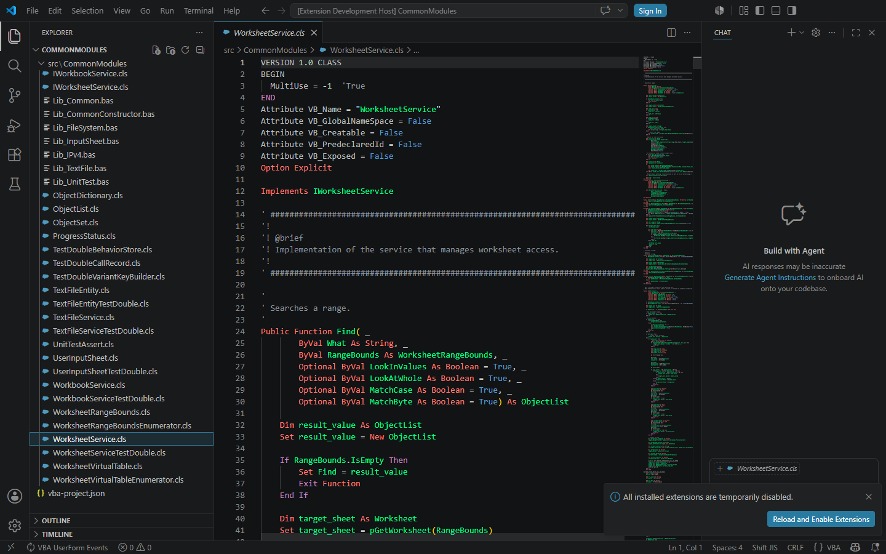
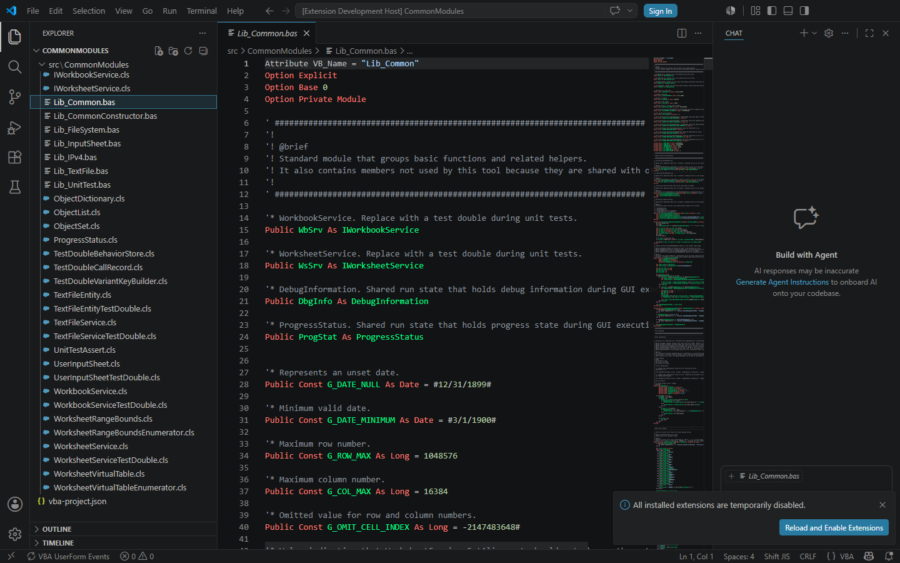

# Issue #365 measured results

The final Windows Release Explorer sequence passed all twenty operations at
115–823 ms. The first preview after all editors closed took 246 ms. Every
natural full-token result matched independent fresh analysis exactly, and
every operation displayed an identifier in the isolated semantic test color
without another input action.

Preparation individually tokenized exactly two large sources:
`Lib_Common.bas` and `WorksheetService.cls`. The runner first previewed
`Lib_Common.bas`, waited for reference-only quiescence, closed it, previewed
it again against the final references, and then previewed
`WorksheetService.cls`. Eight other measured sources remained unvisited,
including `WorkbookService.cls`. The resident-cache result includes repeated
transitions through zero open source documents. No anchor or pinned editor,
synthetic provider request, companion/Excel operation, or complete-validation
wait was used.

## Provenance and conditions

The final source was clean commit
`1f7ee51e67376f256eac8426ce4ffba18c208fe1`. The exact pre-change server was
built and published from detached commit
`58b179e84d270c134c3af478b53205b6b1e345bc` in an isolated worktree. Both
Explorer runs used the same current passive measurement client; that client
was copied into the baseline worktree with its source. The baseline's server
sources remained unchanged. The complete input inventories explicitly record
this instrumentation state.

The final inventory contains 503 relevant production-source and build-input
files with tree SHA-256
`bc25ecdab9579ba595c662b162bf0c127cfe47d9838b7691f38a5561679bf420`.
The final executable SHA-256 is
`805da996fa86d566c347020aad2d72b59ab7089ad723a4a609c57083b0b88c1c`;
the baseline executable SHA-256 is
`0d52ecb2f41f36e09a44af6f8c17a425d9161a07ccd12199484cf5dca1bcfd6f`.
The server is published as a single-file executable; the evidence also lists
all nine published files and their individual hashes.
Evidence documents were added after measurement and do not change those
measured inputs.

Both runs used CommonModules corpus commit
`2e497ef979fb51cea79cf9386b635719172f2e70`, with a clean tracked source tree:
one manifest document definition, 94 source files, 50,846 physical lines, and
49,097 parsed argument lists. `Lib_Common.bas` is 208,331 bytes;
`WorksheetService.cls` is 77,405 bytes. All source-file hashes are retained in
the JSON evidence.

The machine was Windows 10.0.26200 x64, Intel Core 7 150U, 12 logical
processors, and 34,040,168,448 bytes of RAM. The custom power scheme GUID was
`e5a464aa-8081-4ad0-8124-3568713d901d`. The runtime was VS Code 1.125.0,
Electron 42.2.0, Node 24.15.0, .NET 10.0.8, and SDK 10.0.300. Servers were
published in Release. Fresh VS Code profiles, server processes, and
reference-catalog caches were used for each Explorer run. Shared agent
builds and tests were paused; ambient OS/user load and the filesystem cache
were uncontrolled. The measurements occurred on 2026-09-08 JST
(2026-09-07 UTC). There are no omitted samples or removed outliers.

## All twenty Explorer operations

Timing starts immediately before the actual Explorer
`list.selectAndPreserveFocus` action and ends at its uncancelled natural
full-token provider result. The preceding `revealInExplorer` selects the
native tree item without opening it. Renderer capture follows the measured
provider interval. Both runs verified real preview tabs.

For rows with zero sources open before the action, all editors were explicitly
closed and the real close lifecycle completed first. For rows with one source
open, preview replacement emitted `close, open`, itself passing through zero.
Every row had exactly one source open after its recorded open event. Thus the
before/after comparison uses the same lifecycle, including the first operation
following preparation's last close.

| Operation | Source | Open before | Observed lifecycle | Exact before (ms) | Final (ms) |
| ---: | --- | ---: | --- | ---: | ---: |
| 1 | WorksheetService.cls | 0 | open | 3667 | 246 |
| 2 | Lib_Common.bas | 1 | close, open | 4960 | 586 |
| 3 | WorkbookService.cls | 0 | open | 3015 | 823 |
| 4 | Lib_FileSystem.bas | 1 | close, open | 2707 | 120 |
| 5 | ObjectList.cls | 0 | open | 2917 | 780 |
| 6 | WorksheetRangeBounds.cls | 1 | close, open | 2848 | 519 |
| 7 | Lib_UnitTest.bas | 0 | open | 2663 | 329 |
| 8 | FileSystemService.cls | 1 | close, open | 2904 | 512 |
| 9 | Fx_Common.bas | 0 | open | 2557 | 142 |
| 10 | ObjectSet.cls | 1 | close, open | 2896 | 542 |
| 11 | WorksheetService.cls | 0 | open | 3692 | 288 |
| 12 | Lib_Common.bas | 1 | close, open | 4858 | 636 |
| 13 | WorkbookService.cls | 0 | open | 2955 | 251 |
| 14 | Lib_FileSystem.bas | 1 | close, open | 2647 | 115 |
| 15 | ObjectList.cls | 0 | open | 2983 | 206 |
| 16 | WorksheetRangeBounds.cls | 1 | close, open | 2932 | 182 |
| 17 | Lib_UnitTest.bas | 0 | open | 2703 | 153 |
| 18 | FileSystemService.cls | 1 | close, open | 2831 | 199 |
| 19 | Fx_Common.bas | 0 | open | 2589 | 118 |
| 20 | ObjectSet.cls | 1 | close, open | 2809 | 199 |

The final run passed 20/20 against the 1,000 ms limit. The exact pre-change
run passed 0/20, with a range of 2,557–4,960 ms; its failure is preserved.
Both runs passed every full-token/source-revision oracle and renderer check.
The oracle ran in a separate fresh server only after all samples, so it could
not populate the measured server's per-source token state. Each measured
array's SHA-256 equals its fresh oracle array's SHA-256; comparison covered
every integer, not only the hashes or token count.

Final retention traces record reuse of the resident entry after closing the
last document. Its maximum accounted estimate was 623,914,212 bytes
(approximately 624 MB), within the finite 1 GiB total limit and four-entry
limit. The maximum managed heap observed at trace sampling points was
569,434,288 bytes (approximately 569 MB). This is sampled process managed
heap, not a measured retained-object heap size or a continuous heap peak.
The conservative accounting reserves per-source occurrence/token shards even
before all such shards are populated. An earlier 512 MiB limit could not
retain the registry-populated corpus; the evidence informed the 1 GiB bound.

## Cold workspace fixture

The existing cold workspace benchmark ran once in a fresh `vstest` process
per revision, with zero warmups and no exclusions. Its readiness boundary is
`CreateProjectSnapshot` request to returned snapshot. Opening the active
document and projecting its full tokens are measured separately. This fixture
uses bundled catalogs only: external reference preparation is **0 ms because
none is performed**. Actual registry/catalog preparation is reported in the
next section, not inferred from this fixture.

| Phase | Exact before (ms) | Final (ms) |
| --- | ---: | ---: |
| Active document open | 1272.429 | 1095.402 |
| Capture total | 335.674 | 59.794 |
| Scope capture (within capture) | 334.763 | 58.638 |
| Snapshot admission (within capture) | 0.911 | 1.156 |
| Disk source inventory | 3309.737 | 3014.188 |
| Semantic inventory | 86.975 | 128.310 |
| Store/return | 9.095 | 8.703 |
| Interactive Semantic Readiness total | 3741.500 | 3211.000 |
| Subsequent full-token projection | 2185.979 | 2118.793 |
| External reference preparation in this fixture | 0 | 0 |

Both readiness samples passed the existing 9,981.4 ms budget. The final
3,211 ms readiness does not meet the one-second cold stretch target. The
3,014 ms disk inventory and 2,119 ms subsequent token projection remain
material cold costs. These are one observation per revision, not a
statistical improvement claim. The fixture verified 94 sources, 49,097
argument lists, 5,016 tokens, exact active text, and no project-validation
build in the readiness interval; exact full-token correctness is established
separately by the Explorer oracle above.

The final fixture accounted one retained entry at 371,541,492 bytes with
bundled references. Its managed heap after a forced collection was
134,288,408 bytes, measured after the timed work. This differs from the
registry-populated Explorer workload. The test host reports a net8.0
`AppContext` target; the tested projects were built for net10.0 and executed
on .NET 10.0.8. Test-assembly, original TRX, and normalized durable TRX hashes
are in the cold JSON. The durable XML has identical content with repository
UTF-8 without BOM and LF formatting.

## Actual cold Explorer reference preparation

Both fresh Explorer processes naturally opened `Lib_Common.bas`, with a fresh
reference cache and normal diagnostics enabled. Reference settlement required
every admitted catalog job to finish and at least 2,000 ms without another
catalog event. That setup prerequisite did not wait for complete validation.

| Cold/setup boundary | Exact before (ms) | Final (ms) |
| --- | ---: | ---: |
| Initial preview action to natural full tokens | 8919 | 7599 |
| First reference admission to last reference event | 4291.055 | 6947.119 |
| Initial action to last reference event | 5873.226 | 8682.063 |
| Initial action to reference settlement check | 9337 | 10692 |
| Quiet time since last reference event at that check | 3463.774 | 2009.938 |
| Revisit Lib_Common against final references | 4692 | 3276 |
| First WorksheetService preview during preparation | 3865 | 2158 |

Reference preparation was longer in the final observation even though the
initial token result arrived sooner. The first reference-refresh job spent
3,071.484 ms queued before, and 5,876.313 ms queued after; this queue occupies
most of the observed final reference window. Do not combine overlapping
reference and token intervals or claim that all cold phases improved. Initial
tokens may precede final reference publication, which is why the same large
module is revisited before the warm sequence.

Both runs completed 27 reference jobs during initial setup: one refresh,
21 publications, and five commits. The recorded scheduler phases are:

| Work during initial setup | Phase | Exact before (ms) | Final (ms) |
| --- | --- | ---: | ---: |
| didOpen | execution, including source work | 4529.609 | 4902.651 |
| First full-token request | immutable capture | 0.189 | 0.737 |
| First full-token request | queue | 4503.647 | 4877.617 |
| First full-token request | execution | 4280.983 | 2596.084 |
| Reference refresh | execution | 10.865 | 7.034 |
| Reference publications | execution sum | 14.180 | 13.649 |
| Reference commits | execution sum | 21.071 | 9.482 |
| Completed workspace diagnostic job | execution | 402.623 | 371.320 |

These LSP scheduler labels describe their own pipeline boundaries; they are
not replacements for the finer workspace fixture's disk/semantic phases.
Concurrent jobs overlap. Eventual validation remains enabled and is recorded
separately; the measured preview path does not await it. All raw setup and
per-operation scheduler records needed to inspect these boundaries are in
the compact JSON evidence.

## Renderer inspection and remaining limits

The isolated profile maps semantic foreground through `*:vba` to `#01ff87`.
Every sample's read-only DOM capture verifies an identifier with computed
`rgb(1, 255, 135)` in the matching active editor after two animation frames.
The saved representative images were also visually inspected. Additional
recorded witnesses verify resolved, non-declaration `class` tokens for
`IWorksheetService`, `WorksheetRangeBounds`, and `ObjectList` in the class,
and `IWorkbookService` / `IWorksheetService` in the module. Their token
positions, token types, exact oracle, visible DOM lines, and colors agree.

Observation sent no further input or token request. Exact provider-to-paint
completion time is unmeasured; the saved observation timestamp is a later
boundary and screenshot capture is outside the measured provider latency.
The green theme is measurement-only and does not alter production themes.

An earlier one-module diagnostic passed 18/20: the first unvisited large class
took 1,520 ms, and the first module projection after reference publication
took 2,764 ms. Its exact-token checks passed. That failed diagnostic remains
in the evidence, and explains the explicit two-source preparation. The final
run also records its first large class projection at 2,158 ms and the module
revisit against final references at 3,276 ms. Retention does not establish a
one-second first projection for every unvisited large source. The eight
unvisited peers in the final measured sequence did meet the limit.

## Evidence and validation

- [Final 20-operation evidence](issue-365-preview-final.json): all samples,
  lifecycle events, source/build/corpus hashes, oracle hashes, renderer
  witnesses, scheduler phases, and retention traces.
- [Exact pre-change evidence](issue-365-preview-before.json): the same
  scenario, all twenty latency failures, full-token correctness, and actual
  reference preparation.
- [Cold comparison](issue-365-cold-comparison.json),
  [before TRX](issue-365-cold-before.trx), and
  [after TRX](issue-365-cold-after.trx).
- [Earlier failed diagnostic](issue-365-preview-diagnostic.json): 18/20 with
  only the first module prepared, retained as a limitation record.
- [Reproduction procedure](../preview-analysis-performance.md).

The measured production revision passed 2,441 language-server tests, 1,825
syntax tests, 722 extension tests, 102 packaging tests, and the architecture
checks. These were completed before the quiet performance window. Full raw
reports, every screenshot, and isolated profiles remain under the ignored
`test-results/issue-365/preview-before-exact` and `preview-final` directories;
the durable artifacts above carry the review evidence without requiring
those machine-local directories.
